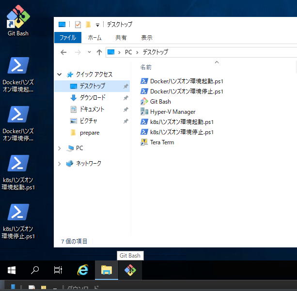
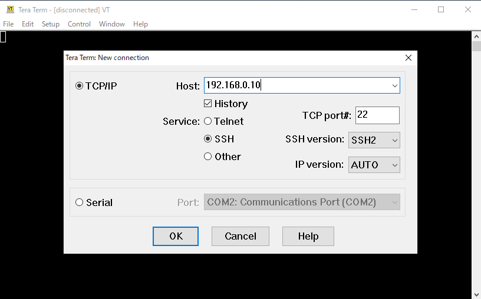

# Docker ハンズオン  

## 目次  
- [Docker ハンズオン](#docker-ハンズオン)
  - [目次](#目次)
  - [環境の立ち上げ](#環境の立ち上げ)
  - [VMへのログインと確認](#vmへのログインと確認)
  - [Dockerの基本操作を試してみる](#dockerの基本操作を試してみる)
    - [Docker コマンドの確認](#docker-コマンドの確認)
    - [DockerでHello-worldコンテナを実行してみる](#dockerでhello-worldコンテナを実行してみる)
    - [コンテナーイメージを事前にダウンロードしてみる](#コンテナーイメージを事前にダウンロードしてみる)
    - [Pullしたコンテナーイメージの確認してみる](#pullしたコンテナーイメージの確認してみる)
    - [Pull済みのコンテナーを実行してみる](#pull済みのコンテナーを実行してみる)
    - [コンテナーの実行状態についての確認してみる](#コンテナーの実行状態についての確認してみる)
    - [コンテナーのログを確認してみる](#コンテナーのログを確認してみる)
    - [コンテナの停止してみる](#コンテナの停止してみる)
      - [Stopできない場合](#stopできない場合)
    - [コンテナを再スタートしてみる](#コンテナを再スタートしてみる)
    - [コンテナを削除してみる](#コンテナを削除してみる)
    - [Pullしたイメージを削除してみる](#pullしたイメージを削除してみる)
    - [実行するコンテナに名前を付けてみる](#実行するコンテナに名前を付けてみる)
    - [コンテナを起動し、対話型シェルを実行](#コンテナを起動し対話型シェルを実行)
    - [起動済みコンテナーのShellへの接続](#起動済みコンテナーのshellへの接続)
    - [docker run オプション [-d]](#docker-run-オプション--d)
    - [コンテナを起動したままにする](#コンテナを起動したままにする)
    - [docker run オプション [-p]](#docker-run-オプション--p)
  - [Dockerを使ったコンテナ開発](#dockerを使ったコンテナ開発)
    - [必要なもの](#必要なもの)
    - [サンプルアプリケーションをBuildしてみる](#サンプルアプリケーションをbuildしてみる)
  - [コンテナーイメージの保管と共有](#コンテナーイメージの保管と共有)
    - [Docker Registry 作成](#docker-registry-作成)
    - [コンテナーイメージのアップロード](#コンテナーイメージのアップロード)
    - [Docker Registryからイメージをダウンロードしてテストしてみる](#docker-registryからイメージをダウンロードしてテストしてみる)
      - [稼働している環境の削除](#稼働している環境の削除)
      - [実行](#実行)
  - [Docker Composeを使ってみる](#docker-composeを使ってみる)
    - [docker-compose の停止](#docker-compose-の停止)
    - [docker-compose の削除](#docker-compose-の削除)
  - [ハンズオンが終わったら](#ハンズオンが終わったら)


## 環境の立ち上げ  
VMはすでにHyper-Vに登録されています。デスクトップ上にハンズオンに必要なVMを起動させるためのスクリプトを用意していますので、スクリプトをダブルクリックして実行します。  

- Dockerハンズオン環境起動.ps1  
  - 少し時間がかかります。 
  
  

デスクトップ上にある*Hyper-V Manager*のショートカットを開き、**docker_almalinux_default_**で始めるVMが起動していることを確認します。  
  


## VMへのログインと確認  
puttyやTeraterm等でSSH接続が可能です。今回はTeratermで接続します。

|||
|:-|:-|
|IP|192.168.0.10|
|user|vagrant|
|password|vagrant|

sudoでパスワードを求められた場合もパスワードは **vagrant** です。

  
  
  
  


## Dockerの基本操作を試してみる  

### Docker コマンドの確認  
Docker がインストールされていることを確認しましょう。また、docker-composeもインストールされているので合わせて確認します。  

```
docker -v
docker-compose -v
```
```
[vagrant@docker ~]$ docker -v
Docker version 20.10.8, build 3967b7d
[vagrant@docker ~]$ docker-compose -v
docker-compose version 1.29.0, build 07737305
[vagrant@docker ~]$
```

### DockerでHello-worldコンテナを実行してみる  
さっそくコンテナを実行してみましょう。
Docker HubでHello-worldコンテナが公開されているので、これをPull（ダウンロード）して実行してみます。

Hello-worldコンテナの情報は下記から確認できます。  
https://hub.docker.com/_/hello-world

`docker run hello-world`

```
[vagrant@docker ~]$ docker run hello-world
Unable to find image 'hello-world:latest' locally
latest: Pulling from library/hello-world
b8dfde127a29: Pull complete
Digest: sha256:9f6ad537c5132bcce57f7a0a20e317228d382c3cd61edae14650eec68b2b345c
Status: Downloaded newer image for hello-world:latest

Hello from Docker!
This message shows that your installation appears to be working correctly.

To generate this message, Docker took the following steps:
 1. The Docker client contacted the Docker daemon.
 2. The Docker daemon pulled the "hello-world" image from the Docker Hub.
    (amd64)
 3. The Docker daemon created a new container from that image which runs the
    executable that produces the output you are currently reading.
 4. The Docker daemon streamed that output to the Docker client, which sent it
    to your terminal.

To try something more ambitious, you can run an Ubuntu container with:
 $ docker run -it ubuntu bash

Share images, automate workflows, and more with a free Docker ID:
 https://hub.docker.com/

For more examples and ideas, visit:
 https://docs.docker.com/get-started/
```


### コンテナーイメージを事前にダウンロードしてみる  
`docker run`でHello-worldを実行しましたが、このとき裏側ではコンテナーイメージをPull（ダウンロード）してきています。  
コンテナーの起動時間を短くするために事前にダウンロードすることができますので試してみます。  

`docker pull nginx:1.21.0`

```
[vagrant@docker ~]$ docker pull nginx:1.21.0
1.21.0: Pulling from library/nginx
69692152171a: Pull complete
30afc0b18f67: Pull complete
596b1d696923: Pull complete
febe5bd23e98: Pull complete
8283eee92e2f: Pull complete
351ad75a6cfa: Pull complete
Digest: sha256:6d75c99af15565a301e48297fa2d121e15d80ad526f8369c526324f0f7ccb750
Status: Downloaded newer image for nginx:1.21.0
docker.io/library/nginx:1.21.0
```

### Pullしたコンテナーイメージの確認してみる  
`docker run`と`docker pull`でコンテナーイメージが２つPullされています。Pullされたイメージは`docker images`で確認できるので試してみましょう。  

`docker images`

```
[vagrant@docker ~]$ docker images
REPOSITORY    TAG       IMAGE ID       CREATED        SIZE
nginx         1.21.0    d1a364dc548d   2 weeks ago    133MB
hello-world   latest    d1165f221234   3 months ago   13.3kB
```

*hello-world*はタグを指定しないため、**latest**が利用されています。*nginx*は **:1.21.0** と指定したので、Tagも **1.21.0** となります。  

> どのようなTagでコンテナーイメージをPullできるかはDocker hub上で確認できます。コンテナーイメージの作成で改めて書きます。    
>    

### Pull済みのコンテナーを実行してみる  
PullしたNginxのコンテナーを実行します。 

`docker run -d nginx:1.21.0`  

**-d**については一旦気にしないでください。  

```
[vagrant@docker ~]$ docker run -d nginx:1.21.0
08dd913973eeeb697d6b33b1aca96b0c50eb1a0f3b12134d114c5dcec5d9514c
```

### コンテナーの実行状態についての確認してみる  
2つのコンテナを実行したので、コンテナの実行状況を確認します。  

`docker ps`

```
[vagrant@docker ~]$ docker ps
CONTAINER ID   IMAGE          COMMAND                  CREATED         STATUS         PORTS     NAMES
08dd913973ee   nginx:1.21.0   "/docker-entrypoint.…"   3 seconds ago   Up 3 seconds   80/tcp    focused_johnson
```

最初に実行したはずのHello-worldのコンテナが表示されていません。
次に `docker ps -a` を実行してみます。  

```
[vagrant@docker ~]$ docker ps -a
CONTAINER ID   IMAGE          COMMAND                  CREATED          STATUS                      PORTS     NAMES
08dd913973ee   nginx:1.21.0   "/docker-entrypoint.…"   3 minutes ago    Up 3 minutes                80/tcp    focused_johnson
616fc1e84e03   hello-world    "/hello"                 38 minutes ago   Exited (0) 38 minutes ago             eloquent_golick
```

Hello-worldのコンテナも表示されます。*STATUS*を見ると **Exited (0) 38 minutes ago**となっています。
これはコンテナを実行し、正常終了したために停止状態になっています。  


### コンテナーのログを確認してみる  
コンテナーが出力したログを確認してみます。コンテナーが停止状態であってもログを確認することができますので、*hello-world*と*nginx*どちらもログが表示できるか確認してみます。  
また、ログを表示するコンテナーを指定するときには、**CONTAINER ID** か **NAME**を利用します。*docker ps -a*で確認できる情報をつかって確認してみます。  

`docker logs 08dd913973ee`  
`docker logs 616fc1e84e03`  
`docker logs focused_johnson`  
`docker logs eloquent_golick`  

- Nginx
```
[vagrant@docker ~]$ docker logs 08dd913973ee
/docker-entrypoint.sh: /docker-entrypoint.d/ is not empty, will attempt to perform configuration
/docker-entrypoint.sh: Looking for shell scripts in /docker-entrypoint.d/
/docker-entrypoint.sh: Launching /docker-entrypoint.d/10-listen-on-ipv6-by-default.sh
10-listen-on-ipv6-by-default.sh: info: Getting the checksum of /etc/nginx/conf.d/default.conf
10-listen-on-ipv6-by-default.sh: info: Enabled listen on IPv6 in /etc/nginx/conf.d/default.conf
/docker-entrypoint.sh: Launching /docker-entrypoint.d/20-envsubst-on-templates.sh
/docker-entrypoint.sh: Launching /docker-entrypoint.d/30-tune-worker-processes.sh
/docker-entrypoint.sh: Configuration complete; ready for start up
2021/06/11 10:45:30 [notice] 1#1: using the "epoll" event method
2021/06/11 10:45:30 [notice] 1#1: nginx/1.21.0
2021/06/11 10:45:30 [notice] 1#1: built by gcc 8.3.0 (Debian 8.3.0-6)
2021/06/11 10:45:30 [notice] 1#1: OS: Linux 4.18.0-305.el8.x86_64
2021/06/11 10:45:30 [notice] 1#1: getrlimit(RLIMIT_NOFILE): 1048576:1048576
2021/06/11 10:45:30 [notice] 1#1: start worker processes
2021/06/11 10:45:30 [notice] 1#1: start worker process 32
2021/06/11 10:45:30 [notice] 1#1: start worker process 33
2021/06/11 10:45:30 [notice] 1#1: start worker process 34
2021/06/11 10:45:30 [notice] 1#1: start worker process 35
```

- hello-world
```
[vagrant@docker ~]$ docker logs 616fc1e84e03

Hello from Docker!
This message shows that your installation appears to be working correctly.

To generate this message, Docker took the following steps:
 1. The Docker client contacted the Docker daemon.
 2. The Docker daemon pulled the "hello-world" image from the Docker Hub.
    (amd64)
 3. The Docker daemon created a new container from that image which runs the
    executable that produces the output you are currently reading.
 4. The Docker daemon streamed that output to the Docker client, which sent it
    to your terminal.

To try something more ambitious, you can run an Ubuntu container with:
 $ docker run -it ubuntu bash

Share images, automate workflows, and more with a free Docker ID:
 https://hub.docker.com/

For more examples and ideas, visit:
 https://docs.docker.com/get-started/

```

### コンテナの停止してみる  
Nginxのコンテナーを停止してみます。  
ここでも**CONTAINER ID** か **NAME**を利用します。

`docker stop 08dd913973ee`

```
[vagrant@docker ~]$ docker stop 08dd913973ee
08dd913973ee

[vagrant@docker ~]$ docker ps -a
CONTAINER ID   IMAGE          COMMAND                  CREATED          STATUS                      PORTS     NAMES
08dd913973ee   nginx:1.21.0   "/docker-entrypoint.…"   21 minutes ago   Exited (0) 2 seconds ago              focused_johnson
616fc1e84e03   hello-world    "/hello"                 56 minutes ago   Exited (0) 56 minutes ago             eloquent_golick
```

*docker ps -a* でステータス確認すると正常に終了していることがわかります。  

#### Stopできない場合  
*docker stop*できない場合は*docker kill*で強制終了することができます。  
強制終了なので非常時のみ利用するものです。  

### コンテナを再スタートしてみる  
停止状態のコンテナーは再スタートすることができます。  
Nginxのコンテナを再スタートしてみます。ここでも**CONTAINER ID** か **NAME**を利用します。

`docker start 08dd913973ee`

```
[vagrant@docker ~]$ docker start 08dd913973ee
08dd913973ee
[vagrant@docker ~]$ docker ps -a
CONTAINER ID   IMAGE          COMMAND                  CREATED             STATUS                      PORTS     NAMES
08dd913973ee   nginx:1.21.0   "/docker-entrypoint.…"   25 minutes ago      Up 1 second                 80/tcp    focused_johnson
616fc1e84e03   hello-world    "/hello"                 About an hour ago   Exited (0) 22 seconds ago             eloquent_golick
```

再度、停止しておきます。  
`docker stop 08dd913973ee`

### コンテナを削除してみる  
停止状態のコンテナーは削除するまで残っています。
停止状態のコンテナーを削除してみましょう。

`docker rm 616fc1e84e03`  
`docker rm 08dd913973ee`  

```
[vagrant@docker ~]$ docker rm 616fc1e84e03
616fc1e84e03
[vagrant@docker ~]$ docker rm 08dd913973ee
08dd913973ee
[vagrant@docker ~]$ docker ps -a
CONTAINER ID   IMAGE     COMMAND   CREATED   STATUS    PORTS     NAMES
[vagrant@docker ~]$
```

### Pullしたイメージを削除してみる  
コンテナーイメージをPullしてローカルに保存されているコンテナーイメージを削除します。  

`docker rmi nginx:1.21.0 hello-world:latest`

```
[vagrant@docker ~]$ docker rmi nginx:1.21.0 hello-world:latest
Untagged: nginx:1.21.0
Untagged: nginx@sha256:6d75c99af15565a301e48297fa2d121e15d80ad526f8369c526324f0f7ccb750
Deleted: sha256:d1a364dc548d5357f0da3268c888e1971bbdb957ee3f028fe7194f1d61c6fdee
Deleted: sha256:fcc8faba78fe8a1f75025781c8fa1841079b75b54fce8408d039f73a48b7a81b
Deleted: sha256:a476b265974ace4c857e3d88b358e848f126297a8249840c72d5f5ea1954a4bf
Deleted: sha256:56722ee1ee7e73a5c6f96ea2959fa442fb4db9f044399bcd939bb0a6eb7919dc
Deleted: sha256:c657df997c75f6c1a9c5cc683e8e34c6f29e5b4c1dee60b632d3477fd5fdd644
Deleted: sha256:e9e1f772d2a8dbbeb6a4a4dcb4f0d07ff1c432bf94fac7a2db2216837bf9ec5b
Deleted: sha256:02c055ef67f5904019f43a41ea5f099996d8e7633749b6e606c400526b2c4b33
Untagged: hello-world:latest
Untagged: hello-world@sha256:9f6ad537c5132bcce57f7a0a20e317228d382c3cd61edae14650eec68b2b345c
Deleted: sha256:d1165f2212346b2bab48cb01c1e39ee8ad1be46b87873d9ca7a4e434980a7726
Deleted: sha256:f22b99068db93900abe17f7f5e09ec775c2826ecfe9db961fea68293744144bd

[vagrant@docker ~]$ docker images
REPOSITORY   TAG       IMAGE ID   CREATED   SIZE
[vagrant@docker ~]$
```

### 実行するコンテナに名前を付けてみる
Dockerでは名前を指定せずにコンテナを実行した場合、任意の名前が自動的に付与されます。
下記の例では、**focused_johnson** という名前が付与されます。

```
[vagrant@docker ~]$ docker run -d nginx:1.21.0
08dd913973eeeb697d6b33b1aca96b0c50eb1a0f3b12134d114c5dcec5d9514c
[vagrant@docker ~]$ docker ps
CONTAINER ID   IMAGE          COMMAND                  CREATED         STATUS         PORTS     NAMES
08dd913973ee   nginx:1.21.0   "/docker-entrypoint.…"   3 seconds ago   Up 3 seconds   80/tcp    focused_johnson
```

コンテナ実行時にパラメータを付与し、**test01**という名前のコンテナーを実行してみます。   

`docker run --name test01 hello-world`

```
[vagrant@docker ~]$ docker run --name test01 hello-world

Hello from Docker!
This message shows that your installation appears to be working correctly.

To generate this message, Docker took the following steps:
 1. The Docker client contacted the Docker daemon.
 2. The Docker daemon pulled the "hello-world" image from the Docker Hub.
    (amd64)
 3. The Docker daemon created a new container from that image which runs the
    executable that produces the output you are currently reading.
 4. The Docker daemon streamed that output to the Docker client, which sent it
    to your terminal.

To try something more ambitious, you can run an Ubuntu container with:
 $ docker run -it ubuntu bash

Share images, automate workflows, and more with a free Docker ID:
 https://hub.docker.com/

For more examples and ideas, visit:
 https://docs.docker.com/get-started/

[vagrant@docker ~]$ docker ps -a
CONTAINER ID   IMAGE         COMMAND    CREATED          STATUS                      PORTS     NAMES
feaddb3a7a39   hello-world   "/hello"   53 seconds ago   Exited (0) 51 seconds ago             test01
```


### コンテナを起動し、対話型シェルを実行
通常、コンテナでは、起動時の状態で稼働させることを前提としていて、起動後にコンテナに対して変更処理などは行いません。なぜならコンテナはその特性上、一度削除されるとそれまでに作成したデータも削除してしまいます。（ストレージを利用する例外は後述）  
よって、運用上コンテナの中でコマンドを実行するのは
  1. トラブルシューティングなどでコンテナ内でコマンドを実行する必要がある場合
  2. コンテナを作成するとき(基本はしない)
になるかと思います。

ここでは、試しに実行したコンテナに入り、コンテナの中でコマンドを実行できるようにしてみます。  

`docker run -it --name test1 centos:7 bash`

```
[vagrant@docker ~]$ docker run -it --name centos centos:7 bash
Unable to find image 'centos:7' locally
7: Pulling from library/centos
2d473b07cdd5: Pull complete
Digest: sha256:0f4ec88e21daf75124b8a9e5ca03c37a5e937e0e108a255d890492430789b60e
Status: Downloaded newer image for centos:7
[root@41625d9187fd /]#
```

`cat /etc/centos-release` を実行することでCentOS 7の中でコマンドを打っていることがわかると思います。  

```
[root@41625d9187fd /]# cat /etc/centos-release
CentOS Linux release 7.9.2009 (Core)
```

Shellは **exit** で抜けることができます。
この時コンテナも停止します。

- StatusがExited になります。
```
[vagrant@docker ~]$ docker ps -a
CONTAINER ID   IMAGE      COMMAND   CREATED         STATUS                     PORTS     NAMES
41625d9187fd   centos:7   "bash"    4 minutes ago   Exited (0) 3 minutes ago             centos
```


### 起動済みコンテナーのShellへの接続  
コンテナを起動し対話型シェルを実行しました。次は起動済みのコンテナのシェルに接続してみます。  
Nginxのコンテナーを起動し、あとからシェルに接続してみます。  

- 起動
`docker run -d --name nginx nginx:latest`

```
[vagrant@docker ~]$ docker run -d --name nginx nginx:latest
Unable to find image 'nginx:latest' locally
latest: Pulling from library/nginx
69692152171a: Pull complete
30afc0b18f67: Pull complete
596b1d696923: Pull complete
febe5bd23e98: Pull complete
8283eee92e2f: Pull complete
351ad75a6cfa: Pull complete
Digest: sha256:6d75c99af15565a301e48297fa2d121e15d80ad526f8369c526324f0f7ccb750
Status: Downloaded newer image for nginx:latest
2ea8eca389eefd09f061b71b401325f2a49b56cc601a9046f41d8b4265e74b90
[vagrant@docker ~]$ docker ps
CONTAINER ID   IMAGE          COMMAND                  CREATED          STATUS         PORTS     NAMES
2ea8eca389ee   nginx:latest   "/docker-entrypoint.…"   11 seconds ago   Up 9 seconds   80/tcp    nginx
```

- シェルに接続
`docker exec -it nginx bash`
- 接続後、OS情報を確認  
`cat /etc/os-release`

```
[vagrant@docker ~]$ docker exec -it nginx bash
root@2ea8eca389ee:/# cat /etc/os-release
PRETTY_NAME="Debian GNU/Linux 10 (buster)"
NAME="Debian GNU/Linux"
VERSION_ID="10"
VERSION="10 (buster)"
VERSION_CODENAME=buster
ID=debian
HOME_URL="https://www.debian.org/"
SUPPORT_URL="https://www.debian.org/support"
BUG_REPORT_URL="https://bugs.debian.org/"
```

Debianベースで動いていることが確認できます。  
このあと**exit**を実行しNginxのシェルから抜け、コンテナを強制的に停止、削除します。    

```
root@2ea8eca389ee:/# exit
exit
[vagrant@docker ~]$ docker rm nginx -f
nginx
[vagrant@docker ~]$ docker ps
CONTAINER ID   IMAGE     COMMAND   CREATED   STATUS    PORTS     NAMES
[vagrant@docker ~]$
```

### docker run オプション [-d]   
nginxの実行時に *docker run -d* と実行しています。これはコンテナをバックグラウンドで実行するオプションになります。  
nginxを *-d* なしに実行すると下記のようになり、*Ctrl+C* で抜けるとコンテナも停止してしまいます。  

```
[vagrant@docker ~]$ docker run --name nginx nginx:latest
/docker-entrypoint.sh: /docker-entrypoint.d/ is not empty, will attempt to perform configuration
/docker-entrypoint.sh: Looking for shell scripts in /docker-entrypoint.d/
/docker-entrypoint.sh: Launching /docker-entrypoint.d/10-listen-on-ipv6-by-default.sh
10-listen-on-ipv6-by-default.sh: info: Getting the checksum of /etc/nginx/conf.d/default.conf
10-listen-on-ipv6-by-default.sh: info: Enabled listen on IPv6 in /etc/nginx/conf.d/default.conf
/docker-entrypoint.sh: Launching /docker-entrypoint.d/20-envsubst-on-templates.sh
/docker-entrypoint.sh: Launching /docker-entrypoint.d/30-tune-worker-processes.sh
/docker-entrypoint.sh: Configuration complete; ready for start up
2021/06/15 00:48:21 [notice] 1#1: using the "epoll" event method
2021/06/15 00:48:21 [notice] 1#1: nginx/1.21.0
2021/06/15 00:48:21 [notice] 1#1: built by gcc 8.3.0 (Debian 8.3.0-6)
2021/06/15 00:48:21 [notice] 1#1: OS: Linux 4.18.0-305.el8.x86_64
2021/06/15 00:48:21 [notice] 1#1: getrlimit(RLIMIT_NOFILE): 1048576:1048576
2021/06/15 00:48:21 [notice] 1#1: start worker processes
2021/06/15 00:48:21 [notice] 1#1: start worker process 32
2021/06/15 00:48:21 [notice] 1#1: start worker process 33
2021/06/15 00:48:21 [notice] 1#1: start worker process 34
2021/06/15 00:48:21 [notice] 1#1: start worker process 35
^C2021/06/15 00:48:26 [notice] 1#1: signal 2 (SIGINT) received, exiting ## <-- ここで Ctrl-Cを実行
2021/06/15 00:48:26 [notice] 33#33: exiting
2021/06/15 00:48:26 [notice] 33#33: exit
2021/06/15 00:48:26 [notice] 32#32: exiting
2021/06/15 00:48:26 [notice] 34#34: exiting
2021/06/15 00:48:26 [notice] 32#32: exit
2021/06/15 00:48:26 [notice] 34#34: exit
2021/06/15 00:48:26 [notice] 35#35: exiting
2021/06/15 00:48:26 [notice] 35#35: exit
2021/06/15 00:48:26 [notice] 1#1: signal 17 (SIGCHLD) received from 33
2021/06/15 00:48:26 [notice] 1#1: worker process 33 exited with code 0
2021/06/15 00:48:26 [notice] 1#1: worker process 34 exited with code 0
2021/06/15 00:48:26 [notice] 1#1: signal 29 (SIGIO) received
2021/06/15 00:48:26 [notice] 1#1: signal 17 (SIGCHLD) received from 34
2021/06/15 00:48:26 [notice] 1#1: signal 17 (SIGCHLD) received from 32
2021/06/15 00:48:26 [notice] 1#1: worker process 32 exited with code 0
2021/06/15 00:48:26 [notice] 1#1: signal 29 (SIGIO) received
2021/06/15 00:48:26 [notice] 1#1: signal 17 (SIGCHLD) received from 35
2021/06/15 00:48:26 [notice] 1#1: worker process 35 exited with code 0
2021/06/15 00:48:26 [notice] 1#1: exit
[vagrant@docker ~]$ docker ps
CONTAINER ID   IMAGE     COMMAND   CREATED   STATUS    PORTS     NAMES
[vagrant@docker ~]$ docker ps -a
CONTAINER ID   IMAGE          COMMAND                  CREATED          STATUS                      PORTS     NAMES
0c2beb88c36c   nginx:latest   "/docker-entrypoint.…"   16 seconds ago   Exited (0) 10 seconds ago             nginx
```

### コンテナを起動したままにする  
OSだけのコンテナを起動したままにしてトラブルシュートなどに使いたい場合は下記のコマンドでコンテナを起動します。
`docker run -itd centos:7 bash`

```
[vagrant@docker ~]$ docker run -itd centos:7 bash
f3a992f48e9a16b7db0097b72f9dd01ed0475e4fb9a0904882826edfa52ad149
[vagrant@docker ~]$ docker ps
CONTAINER ID   IMAGE      COMMAND   CREATED         STATUS         PORTS     NAMES
f3a992f48e9a   centos:7   "bash"    4 seconds ago   Up 2 seconds             quirky_kilby

# 接続してみる  
[vagrant@docker ~]$ docker exec -it quirky_kilby bash
[root@f3a992f48e9a /]# cat /etc/centos-release
CentOS Linux release 7.9.2009 (Core)
```

###  docker run オプション [-p] 
コンテナー上でWebサーバなどを公開する際に、コンテナーのポートに対してDocker hostのポートをマッピングするために利用します。
Docker hostのポート**3001**にアクセスした際にNginxのポート**80**に接続するようにマッピングします。

`docker run -d -p 3001:80 nginx`

```
[vagrant@docker app]$ docker run -d -p 3001:80 nginx
bd31bff0c0a9bbfe45ee1a14014ec93a35269486e2c7b5979a6e4f6e34917aed
[vagrant@docker app]$ docker ps
CONTAINER ID   IMAGE             COMMAND                  CREATED             STATUS             PORTS                                       NAMES
bd31bff0c0a9   nginx             "/docker-entrypoint.…"   4 seconds ago       Up 2 seconds       0.0.0.0:3001->80/tcp, :::3001->80/tcp       lucid_mayer
bfad7531da8c   getting-started   "docker-entrypoint.s…"   About an hour ago   Up About an hour   0.0.0.0:3000->3000/tcp, :::3000->3000/tcp   xenodochial_chaplygin
f3a992f48e9a   centos:7          "bash"                   3 hours ago         Up 3 hours                                                     quirky_kilby
[vagrant@docker app]$ curl http://localhost:3001
<!DOCTYPE html>
<html>
<head>
<title>Welcome to nginx!</title>
<style>
    body {
        width: 35em;
        margin: 0 auto;
        font-family: Tahoma, Verdana, Arial, sans-serif;
    }
</style>
</head>
<body>
<h1>Welcome to nginx!</h1>
<p>If you see this page, the nginx web server is successfully installed and
working. Further configuration is required.</p>

<p>For online documentation and support please refer to
<a href="http://nginx.org/">nginx.org</a>.<br/>
Commercial support is available at
<a href="http://nginx.com/">nginx.com</a>.</p>

<p><em>Thank you for using nginx.</em></p>
</body>
</html>
```

## Dockerを使ったコンテナ開発  
Docker を使ってコンテナ開発（作る）には **docker build** というコマンドを使います。  
この時、*Dockerfile* というファイルを作成し、ここに
  - どのベースイメージを使うか
  - どのパッケージをインストールするか
  - 作成したアプリケーションのソースコードをどこに置くか
  - どんな処理を行うか
を記述し**docker build**を実行します。  
この処理を実行することで、オリジナルのコンテナーイメージが作成されますので、作成されたイメージをリポジトリ（docker hubなど)に配置し、実際に利用することになります。  
  
 

### 必要なもの  

- ベースイメージ  
  - アプリケーションを実行するためのベースイメージ。基本的にはDocker hubなどのWeb上から取得(pull)して利用する
- ソフトウェアパッケージ
  - アプリケーションを実行するために必要なパッケージ。yumやaptなどのパッケージマネージャを利用しインストールする
- アプリケーションソースコード  
  - 自社（自身）で作成したアプリケーションのソースコード。自身のフォルダやGithub上からファイルを取得する
- Dockerfile
  - イメージを生成するために必要な処理が記述されたファイル  

### サンプルアプリケーションをBuildしてみる  
DockerのチュートリアルにあるサンプルアプリケーションをBuildしてみます。  
https://docs.docker.com/get-started/02_our_app/  

1. ソースコードなどを githubから取得し、ディレクトリを移動します。  
`git clone https://github.com/docker/getting-started.git`  
`cd getting-started/app/`

```
[vagrant@docker ~]$ git clone https://github.com/docker/getting-started.git
Cloning into 'getting-started'...
remote: Enumerating objects: 487, done.
remote: Counting objects: 100% (25/25), done.
remote: Compressing objects: 100% (20/20), done.
remote: Total 487 (delta 14), reused 10 (delta 5), pack-reused 462
Receiving objects: 100% (487/487), 3.67 MiB | 14.13 MiB/s, done.
Resolving deltas: 100% (247/247), done.

[vagrant@docker ~]$ cd getting-started/app/
[vagrant@docker app]$ ls
package.json  spec  src  yarn.lock
```

2. Dockerfileを作成します。今回は下記のコマンドでファイルを作成します。  

```
cat << EOF > Dockerfile
# syntax=docker/dockerfile:1
FROM node:12-alpine
RUN apk add --no-cache python g++ make
WORKDIR /app
COPY . .
RUN yarn install --production
CMD ["node", "src/index.js"]
EOF
```

| | |
|:--|:--|
|FROM node:12-alpine|ベースイメージ|
|RUN apk add … |パッケージのインストール|
|WORK DIR /app|作業ディレクトリの指定|
|COPY . .|ファイルコピー|
|CMD ["node", "src/index.js"]|コンテナ実行時に実行するコマンドとパラメータ|

3. docker buildコマンドでイメージを作成します。  
*docker build*は Dockerfile のあるディレクトリで実行します。    
`docker build -t getting-started .`

```
[vagrant@docker app]$ docker build -t getting-started .
Sending build context to Docker daemon  4.659MB
Step 1/6 : FROM node:12-alpine
12-alpine: Pulling from library/node
ddad3d7c1e96: Pull complete
3a8370f05d5d: Pull complete
71a8563b7fea: Pull complete
119c7e14957d: Pull complete
Digest: sha256:9a372efac4c436dfb6dbdea42f08d3ea60a0103a1df54a7da247e4bed1b327f7
Status: Downloaded newer image for node:12-alpine
 ---> deeae3752431
Step 2/6 : RUN apk add --no-cache python g++ make
 ---> Running in cf1e16c8b90b
fetch http://dl-cdn.alpinelinux.org/alpine/v3.11/main/x86_64/APKINDEX.tar.gz
fetch http://dl-cdn.alpinelinux.org/alpine/v3.11/community/x86_64/APKINDEX.tar.gz
(1/21) Installing binutils (2.33.1-r1)
(2/21) Installing gmp (6.1.2-r1)
(3/21) Installing isl (0.18-r0)
(4/21) Installing libgomp (9.3.0-r0)
(5/21) Installing libatomic (9.3.0-r0)
(6/21) Installing mpfr4 (4.0.2-r1)
(7/21) Installing mpc1 (1.1.0-r1)
(8/21) Installing gcc (9.3.0-r0)
(9/21) Installing musl-dev (1.1.24-r3)
(10/21) Installing libc-dev (0.7.2-r0)
(11/21) Installing g++ (9.3.0-r0)
(12/21) Installing make (4.2.1-r2)
(13/21) Installing libbz2 (1.0.8-r1)
(14/21) Installing expat (2.2.9-r1)
(15/21) Installing libffi (3.2.1-r6)
(16/21) Installing gdbm (1.13-r1)
(17/21) Installing ncurses-terminfo-base (6.1_p20200118-r4)
(18/21) Installing ncurses-libs (6.1_p20200118-r4)
(19/21) Installing readline (8.0.1-r0)
(20/21) Installing sqlite-libs (3.30.1-r2)
(21/21) Installing python2 (2.7.18-r0)
Executing busybox-1.31.1-r10.trigger
OK: 212 MiB in 37 packages
Removing intermediate container cf1e16c8b90b
 ---> b9ae27e02acf
Step 3/6 : WORKDIR /app
 ---> Running in 1ffcf5873cdd
Removing intermediate container 1ffcf5873cdd
 ---> b19c12cd8047
Step 4/6 : COPY . .
 ---> 9367387c17e6
Step 5/6 : RUN yarn install --production
 ---> Running in 77c93a4c0d96
yarn install v1.22.5
[1/4] Resolving packages...
[2/4] Fetching packages...
info fsevents@1.2.9: The platform "linux" is incompatible with this module.
info "fsevents@1.2.9" is an optional dependency and failed compatibility check. Excluding it from installation.
[3/4] Linking dependencies...
[4/4] Building fresh packages...
Done in 27.04s.
Removing intermediate container 77c93a4c0d96
 ---> ca070ca438d5
Step 6/6 : CMD ["node", "src/index.js"]
 ---> Running in 5e68d6a6c478
Removing intermediate container 5e68d6a6c478
 ---> 5b03f492e569
Successfully built 5b03f492e569
Successfully tagged getting-started:latest
```

4. コンテナーイメージの確認  
作成したコンテナーイメージは **docker images** で確認できます。  

```
[vagrant@docker app]$ docker images
REPOSITORY        TAG         IMAGE ID       CREATED         SIZE
getting-started   latest      5b03f492e569   2 minutes ago   383MB
nginx             latest      d1a364dc548d   2 weeks ago     133MB
node              12-alpine   deeae3752431   2 months ago    88.9MB
hello-world       latest      d1165f221234   3 months ago    13.3kB
centos            7           8652b9f0cb4c   7 months ago    204MB
```  

5. 動作確認をしてみます。現状はローカルにコンテナーイメージがありますので、それを *docker run*してみます。  
今回作成したイメージはWebサーバーになるので、ポートのマッピングを指定します。コンテナーが**3000**でポートを待ち受けているので、Dockerホストのポート**3000**にアクセスした場合にコンテナーの**3000**にマッピングするように設定します。  

`docker run -d -p 3000:3000 getting-started`

```
[vagrant@docker app]$ docker run -d -p 3000:3000 getting-started
bfad7531da8c519d38cedb28999d86b816879d0cceeabb6ccefc11ca6972f125
[vagrant@docker app]$ docker ps
CONTAINER ID   IMAGE             COMMAND                  CREATED         STATUS         PORTS                                       NAMES
bfad7531da8c   getting-started   "docker-entrypoint.s…"   4 seconds ago   Up 2 seconds   0.0.0.0:3000->3000/tcp, :::3000->3000/tcp   xenodochial_chaplygin
f3a992f48e9a   centos:7          "bash"                   2 hours ago     Up 2 hours                                                 quirky_kilby
[vagrant@docker app]$
```

docker ホスト上のWebブラウザから下記のURLにアクセスします。  
- http://192.168.0.10:3000    
  
 


## コンテナーイメージの保管と共有  
Docker Buildを使ってコンテナーイメージを作成しローカルで実行しました。  
現段階では作成したコンテナーイメージはローカルにしかありません。コンテナーイメージを共有し、他の人たちも利用できるようにどこかにアップロードする必要があります。  
作成したコンテナーイメージはコンテナーレジストリに登録（アップロード）することで共有、公開が可能になります。  

パブリックなレジストリとしては **Docker レジストリ**がありますし、各パブリッククラウドベンダーが運営しているレジストリなどもあります。 
今回はローカルに **Docker Registry** を作成し、そこにアップロードします。(Docker RegistryもDockerで動きます)


### Docker Registry 作成  
コンテナーイメージが公開されているので docker run を実行するのみ

- 起動  
  `docker run -d -p 5000:5000 registry`

```
[vagrant@docker getting-started]$ docker run -d -p 5000:5000 registry
Unable to find image 'registry:latest' locally
latest: Pulling from library/registry
ddad3d7c1e96: Already exists
6eda6749503f: Pull complete
363ab70c2143: Pull complete
5b94580856e6: Pull complete
12008541203a: Pull complete
Digest: sha256:aba2bfe9f0cff1ac0618ec4a54bfefb2e685bbac67c8ebaf3b6405929b3e616f
Status: Downloaded newer image for registry:latest
617b114ea300b3d00e2edc548c4b2f7e7832a8074f08d078669dc846979619b0

[vagrant@docker getting-started]$ docker ps
CONTAINER ID   IMAGE             COMMAND                  CREATED         STATUS         PORTS                                       NAMES
617b114ea300   registry          "/entrypoint.sh /etc…"   6 seconds ago   Up 5 seconds   0.0.0.0:5000->5000/tcp, :::5000->5000/tcp   nice_ardinghelli
```

### コンテナーイメージのアップロード  
`docker push` コマンドを使って、レジストリにコンテナーイメージをアップロードします。  
アップロードする際に、対象のコンテナーイメージにタグをつけてから `docker push` を実行します。  

`docker tag getting-started:latest localhost:5000/example:1.0`  
`docker push localhost:5000/example:1.0`

```
[vagrant@docker getting-started]$ docker tag getting-started:latest localhost:5000/example:1.0

[vagrant@docker getting-started]$ docker images
REPOSITORY               TAG         IMAGE ID       CREATED        SIZE
getting-started          latest      5b03f492e569   3 days ago     383MB
localhost:5000/example   1.0         5b03f492e569   3 days ago     383MB
nginx                    latest      d1a364dc548d   3 weeks ago    133MB
registry                 latest      1fd8e1b0bb7e   2 months ago   26.2MB
node                     12-alpine   deeae3752431   2 months ago   88.9MB
hello-world              latest      d1165f221234   3 months ago   13.3kB
centos                   7           8652b9f0cb4c   7 months ago   204MB

[vagrant@docker getting-started]$ docker push localhost:5000/example:1.0
The push refers to repository [localhost:5000/example]
a98ba205ef63: Pushed
775bdfcd4fb0: Pushed
27ece125e3c3: Pushed
1f696feddea5: Pushed
c29549fbad68: Pushed
efc48a5f6f42: Pushed
33816ea3af7a: Pushed
9a5d14f9f550: Pushed
1.0: digest: sha256:51a00574ec4ae6098f157984432a2b4d458c68ff4e9ec3be3265c989686c2696 size: 2000
```  

### Docker Registryからイメージをダウンロードしてテストしてみる  
実際に Docker Registry からイメージをダウンロードして実行可能かを試してみます。

#### 稼働している環境の削除
getting-startedのコンテナーとコンテナーイメージが残っていますので、先に削除します。  

- 稼働しているコンテナのコンテナーIDを確認  
　`docker ps | grep getting-started`

```
[vagrant@docker getting-started]$ docker ps | grep getting-started
bfad7531da8c   getting-started   "docker-entrypoint.s…"   3 days ago       Up 3 days       0.0.0.0:3000->3000/tcp, :::3000->3000/tcp   xenodochial_chaplygin
```

- コンテナーの停止と削除  
  `docker stop bfad7531da8c`  
  `docker rm bfad7531da8c`  

- コンテナーイメージの削除  
  `docker rmi getting-started:latest localhost:5000/example:1.0`

#### 実行  

`docker run -d -p 3000:3000 localhost:5000/example:1.0`

```
[vagrant@docker getting-started]$ docker run -d -p 3000:3000 localhost:5000/example:1.0
Unable to find image 'localhost:5000/example:1.0' locally
1.0: Pulling from example
ddad3d7c1e96: Already exists
3a8370f05d5d: Already exists
71a8563b7fea: Already exists
119c7e14957d: Already exists
6d727be42267: Pull complete
aa82888e1129: Pull complete
81d1df388a45: Pull complete
a8e5fbfc150d: Pull complete
Digest: sha256:51a00574ec4ae6098f157984432a2b4d458c68ff4e9ec3be3265c989686c2696
Status: Downloaded newer image for localhost:5000/example:1.0
082fec24146b7a8a03a17a1a5f5537a7bb666d3c7a8694bc8894829bb6e7908c

[vagrant@docker getting-started]$ curl http://localhost:3000

<!DOCTYPE html>
<html>
<head>
    <meta charset="utf-8" />
    <meta name="viewport" content="width=device-width, initial-scale=1, shrink-to-fit=no, maximum-scale=1.0, user-scalable=0" />
    <link rel="stylesheet" href="css/bootstrap.min.css" crossorigin="anonymous" />
    <link rel="stylesheet" href="css/font-awesome/all.min.css" crossorigin="anonymous" />
    <link href="https://fonts.googleapis.com/css?family=Lato&display=swap" rel="stylesheet" />
    <link rel="stylesheet" href="css/styles.css" />
    <title>Todo App</title>
</head>
<body>
    <div id="root"></div>
    <script src="js/react.production.min.js"></script>
    <script src="js/react-dom.production.min.js"></script>
    <script src="js/react-bootstrap.js"></script>
    <script src="js/babel.min.js"></script>
    <script type="text/babel" src="js/app.js"></script>
</body>
</html>
```


## Docker Composeを使ってみる  
Docker Compose を使うと、Docker コンテナとして生成される独立した環境内に、簡単にアプリケーションを構成することができます。  
これまでの手順では、コンテナーを実行する際にコマンドを実行していますが、docker-composeでは実行すべきコマンドやパラメータなどをファイルに記述しておき、`docker-compose`コマンドで指定して実行することで一気に実行できます。例えばアプリケーションやDBなどをまとめて実行したい場合や、アプリケーションはBuildしてから実行するなどのことが実現できます。  

ここでは、Wordpress+MyuSQLをDocker-composeで実行してみます。  

- プロジェクトのディレクトリ作成と移動  

  `mkdir ~/wordpress && cd ~/wordpress`

- docker-compose.ymlファイルの作成  

下記の中身をすべてコピペで実行
```
cat <<EOF > docker-compose.yml
version: '3'

services:
   db:
     image: mysql:5.7
     volumes:
       - db_data:/var/lib/mysql
     restart: always
     environment:
       MYSQL_ROOT_PASSWORD: somewordpress
       MYSQL_DATABASE: wordpress
       MYSQL_USER: wordpress
       MYSQL_PASSWORD: wordpress

   wordpress:
     depends_on:
       - db
     image: wordpress:latest
     ports:
       - "8000:80"
     restart: always
     environment:
       WORDPRESS_DB_HOST: db:3306
       WORDPRESS_DB_USER: wordpress
       WORDPRESS_DB_PASSWORD: wordpress
volumes:
    db_data:
EOF
```


- 構築  
  `docker-compose up -d`

```
[vagrant@docker wordpress]$ docker-compose up -d
Creating network "wordpress_default" with the default driver
Creating volume "wordpress_db_data" with default driver
Pulling db (mysql:5.7)...
5.7: Pulling from library/mysql
69692152171a: Already exists
1651b0be3df3: Pull complete
951da7386bc8: Pull complete
0f86c95aa242: Pull complete
37ba2d8bd4fe: Pull complete
6d278bb05e94: Pull complete
497efbd93a3e: Pull complete
a023ae82eef5: Pull complete
e76c35f20ee7: Pull complete
e887524d2ef9: Pull complete
ccb65627e1c3: Pull complete
Digest: sha256:a682e3c78fc5bd941e9db080b4796c75f69a28a8cad65677c23f7a9f18ba21fa
Status: Downloaded newer image for mysql:5.7
Pulling wordpress (wordpress:latest)...
latest: Pulling from library/wordpress
69692152171a: Already exists
2040822db325: Pull complete
9b4ca5ae9dfa: Pull complete
ac1fe7c6d966: Pull complete
5b26fc9ce030: Pull complete
3492f4769444: Pull complete
1dec05775a74: Pull complete
77107a42338e: Pull complete
f58e4093c52a: Pull complete
d32715f578d3: Pull complete
7a73fb2558ce: Pull complete
667b573fcff7: Pull complete
75e2da936ffe: Pull complete
759622df3a7b: Pull complete
c2f98ef02756: Pull complete
50e11300b0a6: Pull complete
de37513870b9: Pull complete
f25501789abc: Pull complete
0cf8e3442952: Pull complete
d45ce270a7e6: Pull complete
534cdc5a6ea6: Pull complete
Digest: sha256:e9da0d6c867249f364cd2292ea0dd01d7281e8dfbcc3e4b39b823f9a790b237b
Status: Downloaded newer image for wordpress:latest
Creating wordpress_db_1 ... done
Creating wordpress_wordpress_1 ... done
```

- 確認  
Windows ホスト上のWebブラウザから [http://192.168.0.10:8000](http://192.168.0.10:8000) にアクセスするとWordpressの初期設定画面が表示されます。  
もし表示されない場合は少し待ってから接続してください。  

### docker-compose の停止  
"docker-compose"で稼働させたコンテナを停止させます。  

`docker-compose stop`    

```
[vagrant@docker wordpress]$ docker-compose stop
Stopping wordpress_wordpress_1 ... done
Stopping wordpress_db_1        ... done
```

停止なので、再スタートさせることもできます。  
今回は実施していないですが、永続ボリュームを持っている場合、"stop"では削除しないのでデータは残っています。  

`docker-compose start`

```
[vagrant@docker wordpress]$ docker-compose start
Starting db        ... done
Starting wordpress ... done
```

### docker-compose の削除  
"docker-compose"で稼働させたコンテナを停止し削除します。  

`docker-compose down`  

```
[vagrant@docker wordpress]$ docker-compose down
Stopping wordpress_wordpress_1 ... done
Stopping wordpress_db_1        ... done
Removing wordpress_wordpress_1 ... done
Removing wordpress_db_1        ... done
Removing network wordpress_default
```

## ハンズオンが終わったら  
Azure Lab Serviceで無操作の場合は自動的にシャットダウンされるように設定されていますので、なにも実施しなくても問題ありません。
Dockerハンズオン環境のみを停止する場合には、デスクトップ上にある**Dockerハンズオン環境停止.ps1**を実行してください。
ハンズオン自体を終了する場合はHyper-Vホストをシャットダウンもしくは、接続切って(リモートデスクトップを[×]で閉じる)ください。

続いてKubernetesのハンズオンを実施する場合は[こちら](../k8s/README.md)から。

