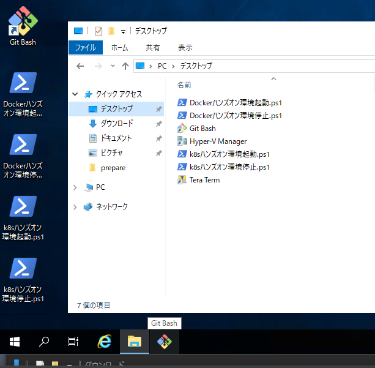
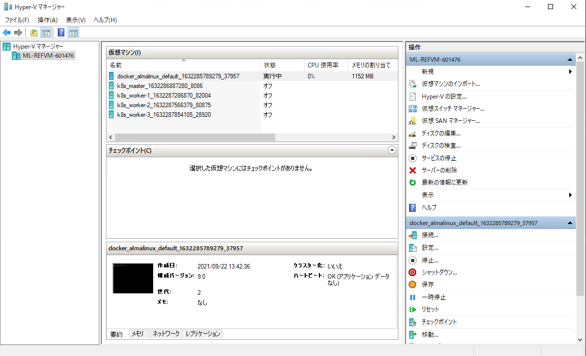
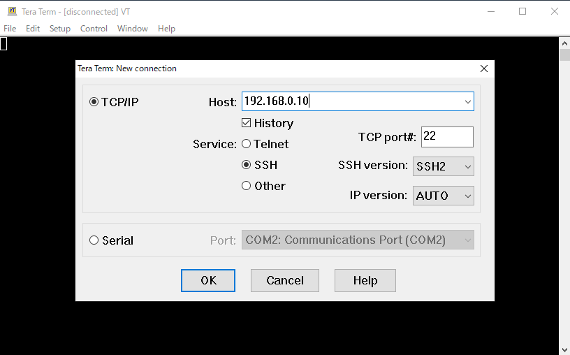
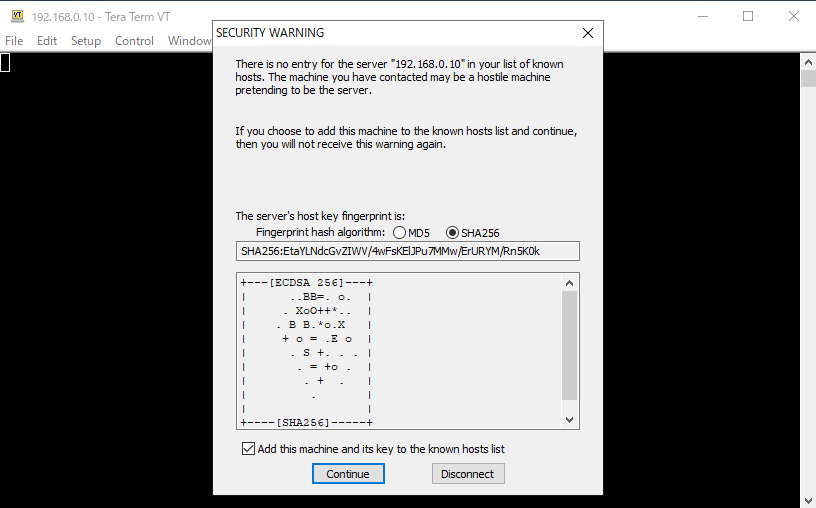
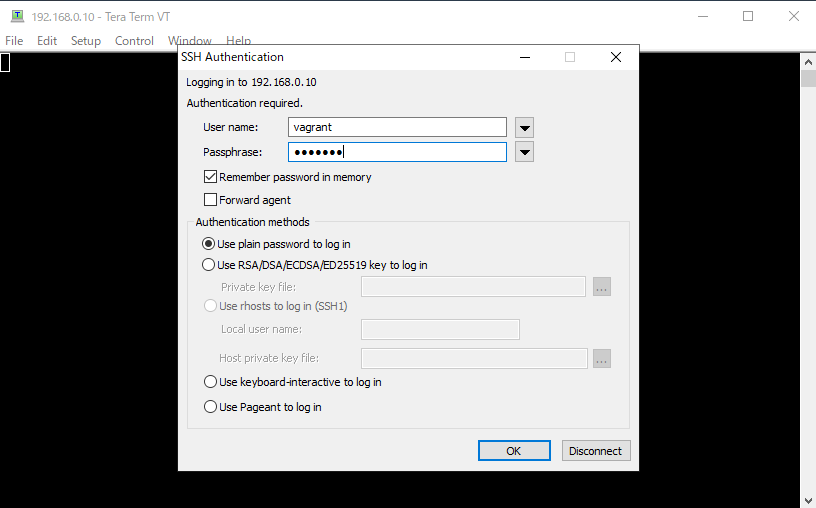
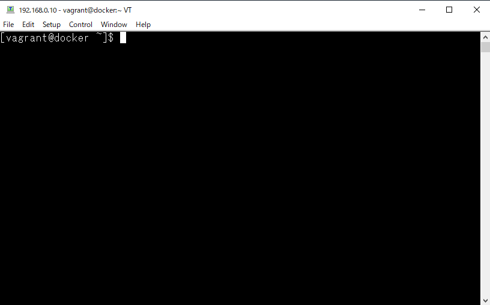
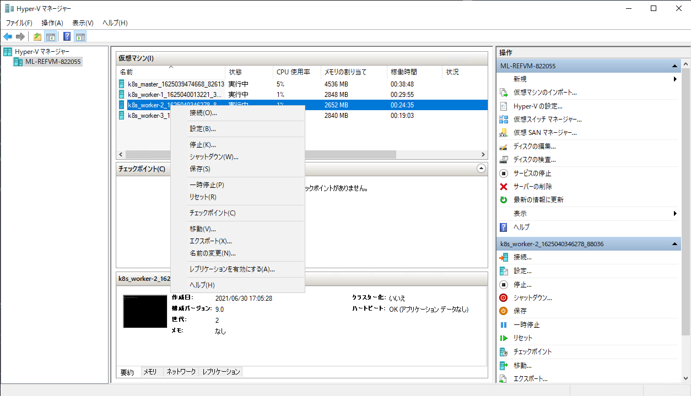
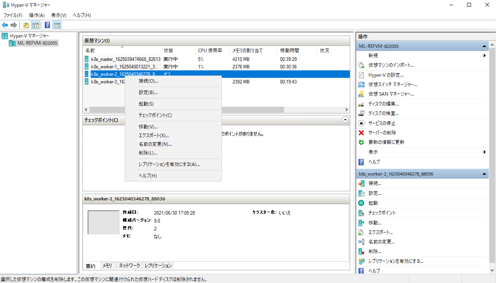
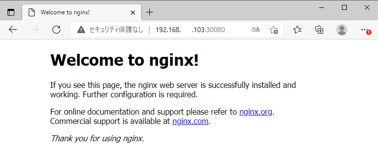
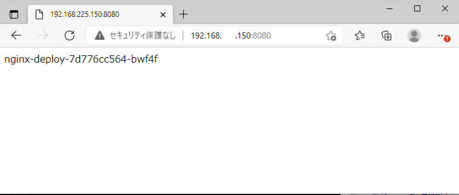

# Kubernetes ハンズオン  

## 目次
- [Kubernetes ハンズオン](#kubernetes-ハンズオン)
  - [目次](#目次)
  - [ハンズオン環境の構成](#ハンズオン環境の構成)
    - [CRI-O (くらいお)](#cri-o-くらいお)
    - [環境の作成方法](#環境の作成方法)
    - [ハンズオン用のVM](#ハンズオン用のvm)
  - [環境の立ち上げ](#環境の立ち上げ)
  - [VMへのログインと確認](#vmへのログインと確認)
  - [KubectlからKubernetesクラスタを確認してみる](#kubectlからkubernetesクラスタを確認してみる)
    - [クラスタの状態確認](#クラスタの状態確認)
  - [CLIによるPodの実行](#cliによるpodの実行)
    - [Pod を確認してみる](#pod-を確認してみる)
    - [Podのログを確認してみる](#podのログを確認してみる)
    - [Podの削除](#podの削除)
  - [マニフェストを使ったPodの実行](#マニフェストを使ったpodの実行)
    - [Nginx のPodを起動するマニフェストを書いてみる](#nginx-のpodを起動するマニフェストを書いてみる)
    - [マニフェストの適用](#マニフェストの適用)
    - [Podの確認](#podの確認)
    - [Nginxの動作確認](#nginxの動作確認)
    - [マニフェストを使ったPodの削除](#マニフェストを使ったpodの削除)
  - [Deploymentコントローラーを使ったPodのデプロイ](#deploymentコントローラーを使ったpodのデプロイ)
    - [Deploymentのマニフェストを作成](#deploymentのマニフェストを作成)
    - [マニフェストを適用してみる](#マニフェストを適用してみる)
    - [作成されたオブジェクトを確認してみる](#作成されたオブジェクトを確認してみる)
    - [スケール機能](#スケール機能)
    - [スケールダウン](#スケールダウン)
    - [ロールアウト](#ロールアウト)
    - [自己回復機能](#自己回復機能)
      - [ノードを復旧するとどうなるか](#ノードを復旧するとどうなるか)
    - [サービスを定義してNginx Podにクラスタ外からアクセスしてみる(NodePort)](#サービスを定義してnginx-podにクラスタ外からアクセスしてみるnodeport)
    - [NodePortのマニフェストを作ってみる](#nodeportのマニフェストを作ってみる)
      - [ServiceがどうやってPodに紐づけられるか？](#serviceがどうやってpodに紐づけられるか)
    - [NodePortのサービスを展開してみる](#nodeportのサービスを展開してみる)
    - [クラスタ外からNginxにアクセスしてみる](#クラスタ外からnginxにアクセスしてみる)
    - [1つのServiceで複数のPodにトラフィックが分散されることを確認してみる](#1つのserviceで複数のpodにトラフィックが分散されることを確認してみる)
    - [LoadBalancerのサービスを使ってみる](#loadbalancerのサービスを使ってみる)
      - [MetalLBのインストール](#metallbのインストール)
      - [LoadBalancerのマニフェストを作成](#loadbalancerのマニフェストを作成)
      - [マニフェストを適用してLoadBalancerサービスを作成](#マニフェストを適用してloadbalancerサービスを作成)
      - [動作確認](#動作確認)
  - [Persistent Volume (永続ボリューム)](#persistent-volume-永続ボリューム)
    - [Rook/Cephのインストール](#rookcephのインストール)
    - [ステータスの確認](#ステータスの確認)
    - [StorageClassの作成](#storageclassの作成)
    - [Rook/Cephを使ったMySQLのデプロイ](#rookcephを使ったmysqlのデプロイ)
      - [確認](#確認)
    - [MySQLにデータを書き込んでみる](#mysqlにデータを書き込んでみる)
    - [コンテナが再作成されてもデータが残っている確認してみる](#コンテナが再作成されてもデータが残っている確認してみる)
  - [ハンズオンが終わったら](#ハンズオンが終わったら)

## ハンズオン環境の構成  
1Master,3Workerの構成になっています。  
これらはすべてvagrantで立ち上げられ、Kubernetesが実行されている状態になります。  

- Node Spec  

|役割|ノード数|OS|CPU|Memory|Disk1|Disk2|
|:-|:-|:-|:-|:-|:-|:-|
|Master|1|Almalinux|4code|4096MB|20GB||
|Worker|3|Almalinux|4code|4096MB|20GB|10GB|

- Kubernetes  
  - ver. 1.21.0
- CRI-O
  - ver. 1.21.0

### CRI-O (くらいお)  
Dockerの代わりに利用できる軽量のコンテナランタイム。
1.20.0以降はDockerは非推奨になるので変更していますが、Kubernetesの使い勝手的には変わりません。  

### 環境の作成方法  
kubeadmを利用してKubernetesクラスタを作成しています。  
今回はすでに作成された状態からのスタートです。

### ハンズオン用のVM  
下記のVMが実行されます。操作は **master** から実行します。  

|hostname|IP|
|:-|:-|
|master|192.168.0.100|
|worker-1|192.168.0.101|
|worker-2|192.168.0.102|
|worker-3|192.168.0.103|

## 環境の立ち上げ  
VMはすでにHyper-Vに登録されています。デスクトップ上にハンズオンに必要なVMを起動させるためのスクリプトを用意していますので、スクリプトをダブルクリックして実行します。  

- k8sハンズオン環境起動.ps1  
  - 少し時間がかかります。  
  
  

デスクトップ上にある*Hyper-V Manager*のショートカットを開き、**docker_almalinux_default_**で始めるVMが起動していることを確認します。  
  


## VMへのログインと確認  
puttyやTeraterm等でSSH接続が可能です。今回はTeratermで接続します。

|||
|:-|:-|
|IP|192.168.0.100|
|user|vagrant|
|password|vagrant|

sudoでパスワードを求められた場合もパスワードは **vagrant** です。

  
  
  
  

## KubectlからKubernetesクラスタを確認してみる
まずは最初にKubectlを使って、Kubernetesクラスタを確認してみます。  

### クラスタの状態確認  

- クラスタの構成情報を確認  
`kubectl cluster-info`

```
[vagrant@master ~]$ kubectl cluster-info
Kubernetes control plane is running at https://192.168.0.100:6443
CoreDNS is running at https://192.168.0.100:6443/api/v1/namespaces/kube-system/services/kube-dns:dns/proxy

To further debug and diagnose cluster problems, use 'kubectl cluster-info dump'.
```

- クラスタのノード構成を確認

`kubectl get node`  
`kubectl get node -o wide`  

```
[vagrant@master ~]$ kubectl get node
NAME                     STATUS   ROLES                  AGE     VERSION
master.training.home     Ready    control-plane,master   22m     v1.21.0
worker-1.training.home   Ready    <none>                 15m     v1.21.0
worker-2.training.home   Ready    <none>                 9m18s   v1.21.0
worker-3.training.home   Ready    <none>                 2m46s   v1.21.0
[vagrant@master ~]$ kubectl get node -o wide
NAME                     STATUS   ROLES                  AGE     VERSION   INTERNAL-IP       EXTERNAL-IP   OS-IMAGE                           KERNEL-VERSION          CONTAINER-RUNTIME
master.training.home     Ready    control-plane,master   22m     v1.21.0   192.168.0.100   <none>        AlmaLinux 8.4 (Electric Cheetah)   4.18.0-305.el8.x86_64   cri-o://1.21.0
worker-1.training.home   Ready    <none>                 15m     v1.21.0   192.168.0.101   <none>        AlmaLinux 8.4 (Electric Cheetah)   4.18.0-305.el8.x86_64   cri-o://1.21.0
worker-2.training.home   Ready    <none>                 9m22s   v1.21.0   192.168.0.102   <none>        AlmaLinux 8.4 (Electric Cheetah)   4.18.0-305.el8.x86_64   cri-o://1.21.0
worker-3.training.home   Ready    <none>                 2m50s   v1.21.0   192.168.0.103   <none>        AlmaLinux 8.4 (Electric Cheetah)   4.18.0-305.el8.x86_64   cri-o://1.21.0
```

> *-o wide*と指定することで詳細な情報を出力することができます。  
> これ以外にも *-o yaml* でyaml形式で出力することもできます。  
> *kubectl get node* 以外でも利用できるので各手順内で確認してみてください。  


## CLIによるPodの実行  
早速、Kubernetes上でコンテナを動かす際の最小単位であるPodを動かしてみます。  

`kubectl run hello-world --image=hello-world -it --restart=Never`  

```
[vagrant@master ~]$ kubectl run hello-world --image=hello-world -it --restart=Never

Hello from Docker!
This message shows that your installation appears to be working correctly.

To generate this message, Docker took the following steps:
 1. The Docker client contacted the Docker daemon.
 2. The Docker daemon pulled the "hello-world" image from the Docker Hub.
    (amd64)
 3. The Docker daemon created a new container from that image which runs the
    executable that produces the output you are currently reading.
 4. The Docker daemon streamed that output to the Docker client, which sent it
    to your terminal.

To try something more ambitious, you can run an Ubuntu container with:
 $ docker run -it ubuntu bash

Share images, automate workflows, and more with a free Docker ID:
 https://hub.docker.com/

For more examples and ideas, visit:
 https://docs.docker.com/get-started/
```  

### Pod を確認してみる  
*kubectl get pod* や *kubectl describe pod {pod_name}* でPodの状態や詳細を確認することができます。  
先ほど試した *-o wide* も併せて確認してみましょう。  

`kubectl get pod`  

`kubectl get pod -o wide`  

`kubectl describe pod hello-world`  


```
[vagrant@master ~]$ kubectl get pod
NAME          READY   STATUS      RESTARTS   AGE
hello-world   0/1     Completed   0          32s
[vagrant@master ~]$ kubectl get pod -o wide
NAME          READY   STATUS      RESTARTS   AGE   IP             NODE                     NOMINATED NODE   READINESS GATES
hello-world   0/1     Completed   0          36s   10.244.3.193   worker-2.training.home   <none>           <none>
[vagrant@master ~]$ kubectl describe pod hello-world
Name:         hello-world
Namespace:    default
Priority:     0
Node:         worker-2.training.home/192.168.0.102
Start Time:   Mon, 21 Jun 2021 14:15:02 +0900
Labels:       run=hello-world
Annotations:  cni.projectcalico.org/podIP:
              cni.projectcalico.org/podIPs:
Status:       Succeeded
IP:           10.244.3.193
IPs:
  IP:  10.244.3.193
Containers:
  hello-world:
    Container ID:   cri-o://1343321264d27e281604dde1281528dd86cc898a94462fe47519ec90f20ba330
    Image:          hello-world
    Image ID:       docker.io/library/hello-world@sha256:1b26826f602946860c279fce658f31050cff2c596583af237d971f4629b57792
    Port:           <none>
    Host Port:      <none>
    State:          Terminated
      Reason:       Completed
      Exit Code:    0
      Started:      Mon, 21 Jun 2021 14:15:12 +0900
      Finished:     Mon, 21 Jun 2021 14:15:12 +0900
    Ready:          False
    Restart Count:  0
    Environment:    <none>
    Mounts:
      /var/run/secrets/kubernetes.io/serviceaccount from kube-api-access-6pksr (ro)
Conditions:
  Type              Status
  Initialized       True
  Ready             False
  ContainersReady   False
  PodScheduled      True
Volumes:
  kube-api-access-6pksr:
    Type:                    Projected (a volume that contains injected data from multiple sources)
    TokenExpirationSeconds:  3607
    ConfigMapName:           kube-root-ca.crt
    ConfigMapOptional:       <nil>
    DownwardAPI:             true
QoS Class:                   BestEffort
Node-Selectors:              <none>
Tolerations:                 node.kubernetes.io/not-ready:NoExecute op=Exists for 300s
                             node.kubernetes.io/unreachable:NoExecute op=Exists for 300s
Events:
  Type    Reason     Age   From               Message
  ----    ------     ----  ----               -------
  Normal  Scheduled  48s   default-scheduler  Successfully assigned default/hello-world to worker-2.training.home
  Normal  Pulling    47s   kubelet            Pulling image "hello-world"
  Normal  Pulled     39s   kubelet            Successfully pulled image "hello-world" in 7.98178352s
  Normal  Created    39s   kubelet            Created container hello-world
  Normal  Started    39s   kubelet            Started container hello-world
```

> Podはどのノードに作成されるか？
> 基本的にはKubernetesが自動でノードの負荷状況などをみて作成するので、管理者側でどこに作成するかを気にする必要はありません
> どうしても指定のノードに作成したい要件がある場合は ラベルをつかった方法やアフィニティ/アンチアフィニティルールを利用します。  

### Podのログを確認してみる  
KubernetesではPodが起動する際に失敗している場合は、*kubectl describe pod {pod_name}* で状況を確認します。
Podが動作しているにもかかわらず、正常な動作になっていない場合は、Podのログを確認します。  

`kubectl logs hello-world`  
Hello-worldのログでは下記のように出力されています。

```
[vagrant@master ~]$ kubectl logs hello-world

Hello from Docker!
This message shows that your installation appears to be working correctly.

To generate this message, Docker took the following steps:
 1. The Docker client contacted the Docker daemon.
 2. The Docker daemon pulled the "hello-world" image from the Docker Hub.
    (amd64)
 3. The Docker daemon created a new container from that image which runs the
    executable that produces the output you are currently reading.
 4. The Docker daemon streamed that output to the Docker client, which sent it
    to your terminal.

To try something more ambitious, you can run an Ubuntu container with:
 $ docker run -it ubuntu bash

Share images, automate workflows, and more with a free Docker ID:
 https://hub.docker.com/

For more examples and ideas, visit:
 https://docs.docker.com/get-started/
``` 

### Podの削除
作成したPodを削除します。  
削除は *kubectl delete pod {pod_name}* で実行します。  

`kubectl delete pod hello-world`   

実行後に `kubectl get pod`でPodが削除されていることを確認します。  

```
[vagrant@master ~]$ kubectl delete pod hello-world
pod "hello-world" deleted
[vagrant@master ~]$ kubectl get pod
No resources found in default namespace.
```

## マニフェストを使ったPodの実行  
Kubernetesではマニフェストというファイルを作成し、それをKubernetes APIに読み込ませることでPodなどを作成することが基本的な利用方法になります。  
ここではマニフェストを作成し、Podを実行してみます。  
※サンプルコードを実行し、実際のマニフェストでこうやって動くのかというものを体験してください。  

> マニフェストとは  
> Kubernetesのオブジェクトを生成するために、そのオブジェクトに対応するAPIのバージョン、メタ情報、使用などを YAML形式やJSON形式で記述したファイルのことです。  


### Nginx のPodを起動するマニフェストを書いてみる  
下記のファイルをvi やvim などで作成してみてください。  
エディタが必要であれば、 `dnf install {エディタ名}` でインストールしていただいても問題ありません。  

- ファイル名: nginx_pod.yaml  
```
apiVersion: v1
kind: Pod
metadata: 
  name: nginx-pod
spec: 
  containers: 
  - name: nginx
    image: nginx:latest
```

コピペ用
```
cat <<EOF > nginx_pod.yaml
apiVersion: v1
kind: Pod
metadata: 
  name: nginx-pod
spec: 
  containers: 
  - name: nginx
    image: nginx:latest
EOF
```

### マニフェストの適用  
マニフェストを *kubectl*コマンドから適用します。  

`kubectl apply -f nginx_pod.yaml`

```
[vagrant@master ~]$ kubectl apply -f nginx_pod.yaml
pod/nginx-pod created
```

マニフェストを適用することで、Kubernetesに命令がわたり、コンテナーイメージがない場合はダウンロードしPodでコンテナーを実行します。  
コンテナーイメージを持っていない場合はダウンロードしますので少し時間がかかります。  

### Podの確認  
Podが作成されていることを確認します。  

`kubectl get pod`  
`kubectl describe pod nginx-pod`  

```
[vagrant@master ~]$ kubectl get pod
NAME        READY   STATUS    RESTARTS   AGE
nginx-pod   1/1     Running   0          2m10s
[vagrant@master ~]$ kubectl describe po nginx-pod
Name:         nginx-pod
Namespace:    default
Priority:     0
Node:         worker-3.training.home/192.168.0.103
Start Time:   Mon, 21 Jun 2021 14:17:44 +0900
Labels:       <none>
Annotations:  cni.projectcalico.org/podIP: 10.244.30.65/32
              cni.projectcalico.org/podIPs: 10.244.30.65/32
Status:       Running
IP:           10.244.30.65
IPs:
  IP:  10.244.30.65
Containers:
  nginx:
    Container ID:   cri-o://188c9b740fc066091f2cf505a55e8027ef5265cc6e14ddb4ec9ccc9a2617858f
    Image:          nginx:latest
    Image ID:       docker.io/library/nginx@sha256:61191087790c31e43eb37caa10de1135b002f10c09fdda7fa8a5989db74033aa
    Port:           <none>
    Host Port:      <none>
    State:          Running
      Started:      Mon, 21 Jun 2021 14:18:09 +0900
    Ready:          True
    Restart Count:  0
    Environment:    <none>
    Mounts:
      /var/run/secrets/kubernetes.io/serviceaccount from kube-api-access-rfhwr (ro)
Conditions:
  Type              Status
  Initialized       True
  Ready             True
  ContainersReady   True
  PodScheduled      True
Volumes:
  kube-api-access-rfhwr:
    Type:                    Projected (a volume that contains injected data from multiple sources)
    TokenExpirationSeconds:  3607
    ConfigMapName:           kube-root-ca.crt
    ConfigMapOptional:       <nil>
    DownwardAPI:             true
QoS Class:                   BestEffort
Node-Selectors:              <none>
Tolerations:                 node.kubernetes.io/not-ready:NoExecute op=Exists for 300s
                             node.kubernetes.io/unreachable:NoExecute op=Exists for 300s
Events:
  Type    Reason     Age    From               Message
  ----    ------     ----   ----               -------
  Normal  Scheduled  2m26s  default-scheduler  Successfully assigned default/nginx-pod to worker-3.training.home
  Normal  Pulling    2m26s  kubelet            Pulling image "nginx:latest"
  Normal  Pulled     2m2s   kubelet            Successfully pulled image "nginx:latest" in 23.241993691s
  Normal  Created    2m2s   kubelet            Created container nginx
  Normal  Started    2m2s   kubelet            Started container nginx
```

### Nginxの動作確認  
NginxのpodでサンプルのWebページが表示できるようになっているので、Webページが参照可能か確認します。
しかし、Kubernetesのクラスタの**外**からNginxのPodに接続するには **Service** というものが必要になります。これは後ほど実施するので、ここでは別のPodを立ち上げてPod間の通信で確認してみます。  

- Nginx podのIPアドレス確認
  `kubectl get po -o wide`  
  
```
[vagrant@master ~]$ kubectl get pod -o wide
NAME        READY   STATUS    RESTARTS   AGE     IP            NODE                     NOMINATED NODE   READINESS GATES
nginx-pod   1/1     Running   0          3m15s   10.244.13.1   worker-1.training.home   <none>           <none>
```

- 別Podを対話型で実行してNginxに接続してみる  
  `kubectl run busybox --image=busybox --restart=Never --rm -it sh`  

  `wget -q -O - http://10.244.13.1`  <-IPは自身の環境のNginx PodのIPにしてください。  

```
[vagrant@master ~]$ kubectl run busybox --image=busybox --restart=Never --rm -it sh
If you don't see a command prompt, try pressing enter.
/ # wget -q -O - http://10.244.13.1
<!DOCTYPE html>
<html>
<head>
<title>Welcome to nginx!</title>
<style>
    body {
        width: 35em;
        margin: 0 auto;
        font-family: Tahoma, Verdana, Arial, sans-serif;
    }
</style>
</head>
<body>
<h1>Welcome to nginx!</h1>
<p>If you see this page, the nginx web server is successfully installed and
working. Further configuration is required.</p>

<p>For online documentation and support please refer to
<a href="http://nginx.org/">nginx.org</a>.<br/>
Commercial support is available at
<a href="http://nginx.com/">nginx.com</a>.</p>

<p><em>Thank you for using nginx.</em></p>
</body>
</html>
/ #
```

`exit` でshを終了します。その時、同時に一時的に作成した別のPodは削除されます。これはPod実行時に *--rm* を付与したためです。  

```
/ # exit
pod "busybox" deleted
[vagrant@master ~]$
```


### マニフェストを使ったPodの削除  
マニフェストを使って作ったオブジェクトはマニフェストを使って削除することができます。  
*kubectl delete -f {manifest_file}* で削除されます。

`kubectl delete -f nginx_pod.yaml`  

```
[vagrant@master ~]$ kubectl delete -f nginx_pod.yaml
pod "nginx-pod" deleted
[vagrant@master ~]$ kubectl get pod
No resources found in default namespace.
```

## Deploymentコントローラーを使ったPodのデプロイ
詳細は[こちら](https://kubernetes.io/ja/docs/concepts/workloads/controllers/deployment/)を確認してください。  
わかりやすい動作としては、Deploymentの設定で *Replicas* というものがあり、Deployment(実際にはReplica Set)はそこに指定されたPodが常に動作するように設定してくれます。  

これは
- 要求を待ち続ける
- 水平スケールができる
- 異常終了したら再起動すればよい   
  
のような条件で稼働させることができるアプリケーションに適したものです。  
フロントエンドのWebサーバーなどはこれを使うことで負荷状況に応じて水平スケールすることやローリングアップデートを行うことなども可能です。  
実運用時にはPod単体で動かすのではなく、Deploymentやその他のコントローラーを使ってPodを展開することになります。  

### Deploymentのマニフェストを作成  

下記のファイルをvi やvim などで作成してみてください。  
エディタが必要であれば、 `dnf install {エディタ名}` でインストールしていただいても問題ありません。    

- ファイル名: nginx_deployment.yaml  
```
apiVersion: apps/v1
kind: Deployment
metadata: 
  name: nginx-deploy            # Deploymentの名前
spec: 
  replicas: 3                   # Podテンプレート(template以下の項目)からPodをいくつ起動するか
  selector: 
    matchLabels:                # テンプレートとDeploymentを紐づけるラベル
      app: nginx                # spec.template.metadata.labels.以下の値と一致する必要がある
  template:                     # Podのひな型になるテンプレート  
    metadata: 
      labels:
        app: nginx              # spec.selector.matchLabels.以下の値と一致する必要がある
    spec:                       # コンテナの仕様
      containers: 
      - name: nginx
        image: nginx:latest
```

コピペ用
```
cat <<EOF > nginx_deployment.yaml
apiVersion: apps/v1
kind: Deployment
metadata: 
  name: nginx-deploy
spec: 
  replicas: 3
  selector: 
    matchLabels: 
      app: nginx
  template:
    metadata: 
      labels:
        app: nginx
    spec: 
      containers: 
      - name: nginx
        image: nginx:latest
EOF
```

### マニフェストを適用してみる

`kubectl apply -f nginx_deployment.yaml`

```
[vagrant@master ~]$ kubectl apply -f nginx_deployment.yaml
deployment.apps/nginx-deploy created
```

### 作成されたオブジェクトを確認してみる  
いくつかコマンドを実行し、オブジェクトを確認します。

`kubectl get deployment -o wide`  
`kubectl get replicaset -o wide`  
`kubectl get pod -o wide`  

```
[vagrant@master ~]$ kubectl get deployment -o wide
NAME           READY   UP-TO-DATE   AVAILABLE   AGE   CONTAINERS   IMAGES         SELECTOR
nginx-deploy   3/3     3            3           13m   nginx        nginx:latest   app=nginx
[vagrant@master ~]$ kubectl get replicaset -o wide
NAME                      DESIRED   CURRENT   READY   AGE   CONTAINERS   IMAGES         SELECTOR
nginx-deploy-55649fd747   3         3         3       13m   nginx        nginx:latest   app=nginx,pod-template-hash=55649fd747
[vagrant@master ~]$ kubectl get pod -o wide
NAME                            READY   STATUS    RESTARTS   AGE   IP             NODE                     NOMINATED NODE   READINESS GATES
nginx-deploy-55649fd747-995t8   1/1     Running   0          13m   10.244.30.69   worker-3.training.home   <none>           <none>
nginx-deploy-55649fd747-qqpm2   1/1     Running   0          13m   10.244.30.68   worker-3.training.home   <none>           <none>
nginx-deploy-55649fd747-vzdwd   1/1     Running   0          13m   10.244.3.194   worker-2.training.home   <none>           <none>
```

### スケール機能  
Deploymentの*replicas* の値を変更してPodをスケールしてみます。  
**nginx_deployment.yaml**ファイルの **replicas** の値を **10** に変更し、`kubectl apply -f nginx_deployment.yaml` を再度実行します。  

- 変更
```
apiVersion: apps/v1
kind: Deployment
metadata: 
  name: nginx-deploy            # Deploymentの名前
spec: 
  replicas: 10                   # Podテンプレート(template以下の項目)からPodをいくつ起動するか
  selector: 
    matchLabels:                # テンプレートとDeploymentを紐づけるラベル
      app: nginx                # spec.template.metadata.labels.以下の値と一致する必要がある
  template:                     # Podのひな型になるテンプレート  
    metadata: 
      labels:
        app: nginx              # spec.selector.matchLabels.以下の値と一致する必要がある
    spec:                       # コンテナの仕様
      containers: 
      - name: nginx
        image: nginx:latest
```

- 実行
```
[vagrant@master ~]$ kubectl apply -f nginx_deployment.yaml
deployment.apps/nginx-deploy configured

[vagrant@master ~]$ kubectl get pod
NAME                            READY   STATUS    RESTARTS   AGE
nginx-deploy-55649fd747-5dlvl   1/1     Running   0          45s
nginx-deploy-55649fd747-98gfl   1/1     Running   0          45s
nginx-deploy-55649fd747-995t8   1/1     Running   0          22m
nginx-deploy-55649fd747-9djb9   1/1     Running   0          45s
nginx-deploy-55649fd747-gvqpr   1/1     Running   0          45s
nginx-deploy-55649fd747-hhqrl   1/1     Running   0          45s
nginx-deploy-55649fd747-qqpm2   1/1     Running   0          22m
nginx-deploy-55649fd747-qwmbb   1/1     Running   0          45s
nginx-deploy-55649fd747-vcjgh   1/1     Running   0          45s
nginx-deploy-55649fd747-vzdwd   1/1     Running   0          22m
```

*AGE*が45秒のPodが 7個あり、合計10個のPodが動いています。  


### スケールダウン  
10個に増やしたPodを5個に減らしてみます。次はコマンドベースで実行します。  

`kubectl scale --replicas=5 deployment nginx-deploy`

```
[vagrant@master ~]$ kubectl scale --replicas=5 deployment nginx-deploy
deployment.apps/nginx-deploy scaled

[vagrant@master ~]$ kubectl get pod
NAME                            READY   STATUS    RESTARTS   AGE
nginx-deploy-55649fd747-98gfl   1/1     Running   0          3m25s
nginx-deploy-55649fd747-995t8   1/1     Running   0          25m
nginx-deploy-55649fd747-gvqpr   1/1     Running   0          3m25s
nginx-deploy-55649fd747-hhqrl   1/1     Running   0          3m25s
nginx-deploy-55649fd747-qqpm2   1/1     Running   0          25m
```

### ロールアウト  
詳細は[こちら](https://kubernetes.io/ja/docs/concepts/workloads/controllers/deployment/#updating-a-deployment)をご確認ください。  
Podで実行するコンテナーイメージファイルが実際のアプリケーションとなりますが、このコンテナーイメージを更新したときに、マニフェストもしくはCLIでコンテナーイメージを変更することで、アップデートを自動で実行してくれます。  

実際にはロールアウト時の挙動も細かく設定できますが、今回はデフォルト設定のまま、どのように動くか見ていきます。  

- 準備として別のコンソール(teratermやGitBashなど)を開き、masterに接続します。  
  接続後に、`watch -n1 kubectl get pod -o wide` を実行し、Podのステータスを見れるようにしておきます。  

- すでに接続のコンソールから **nginx_deployment.yaml** ファイルを開き、2か所変更します。  

```
apiVersion: apps/v1
kind: Deployment
metadata: 
  name: nginx-deploy            
spec: 
  replicas: 5                   # CLIで 5 に変更しているので、 5 と指定する
  selector: 
    matchLabels:                
      app: nginx                
  template:                       
    metadata: 
      labels:
        app: nginx              
    spec:                       
      containers: 
      - name: nginx
        image: nginx:1.20.1     # latestから 1.20.1 に変更
```

- 適用して変更する。別途立ち上げたコンソールで変更されていく様子を確認する  

```
[vagrant@master ~]$ kubectl apply -f nginx_deployment.yaml
deployment.apps/nginx-deploy configured
[vagrant@master ~]$ kubectl get po
NAME                            READY   STATUS              RESTARTS   AGE
nginx-deploy-55649fd747-98gfl   1/1     Running             0          19m
nginx-deploy-55649fd747-995t8   1/1     Running             0          40m
nginx-deploy-55649fd747-gvqpr   1/1     Terminating         0          19m
nginx-deploy-55649fd747-hhqrl   1/1     Running             0          19m
nginx-deploy-55649fd747-qqpm2   1/1     Running             0          40m
nginx-deploy-7d776cc564-9pjld   0/1     ContainerCreating   0          2s
nginx-deploy-7d776cc564-b8hks   0/1     ContainerCreating   0          2s
nginx-deploy-7d776cc564-skklz   0/1     ContainerCreating   0          2s
[vagrant@master ~]$ kubectl get pod
NAME                            READY   STATUS              RESTARTS   AGE
nginx-deploy-55649fd747-98gfl   1/1     Terminating         0          19m
nginx-deploy-55649fd747-995t8   1/1     Running             0          41m
nginx-deploy-55649fd747-hhqrl   0/1     Terminating         0          19m
nginx-deploy-55649fd747-qqpm2   1/1     Running             0          41m
nginx-deploy-7d776cc564-9pjld   0/1     ContainerCreating   0          25s
nginx-deploy-7d776cc564-b8hks   1/1     Running             0          25s
nginx-deploy-7d776cc564-dqlrw   0/1     ContainerCreating   0          1s
nginx-deploy-7d776cc564-lvt87   0/1     ContainerCreating   0          6s
nginx-deploy-7d776cc564-skklz   1/1     Running             0          25s
[vagrant@master ~]$ kubectl get pod
NAME                            READY   STATUS              RESTARTS   AGE
nginx-deploy-55649fd747-qqpm2   1/1     Terminating         0          41m
nginx-deploy-7d776cc564-9pjld   1/1     Running             0          45s
nginx-deploy-7d776cc564-b8hks   1/1     Running             0          45s
nginx-deploy-7d776cc564-dqlrw   0/1     ContainerCreating   0          21s
nginx-deploy-7d776cc564-lvt87   1/1     Running             0          26s
nginx-deploy-7d776cc564-skklz   1/1     Running             0          45s
[vagrant@master ~]$ kubectl get pod
NAME                            READY   STATUS    RESTARTS   AGE
nginx-deploy-7d776cc564-9pjld   1/1     Running   0          49s
nginx-deploy-7d776cc564-b8hks   1/1     Running   0          49s
nginx-deploy-7d776cc564-dqlrw   1/1     Running   0          25s
nginx-deploy-7d776cc564-lvt87   1/1     Running   0          30s
nginx-deploy-7d776cc564-skklz   1/1     Running   0          49s
```

- Container Imageを確認してみる  
`kubectl describe pod nginx-deploy-********-*****` を実行して利用しているContainer Imageが **nginx:1.20.1** となっていることを確認します。   

```
[vagrant@master ~]$ kubectl describe pod nginx-deploy-7d776cc564-skklz
Name:         nginx-deploy-7d776cc564-skklz
Namespace:    default
Priority:     0
Node:         worker-2.training.home/192.168.0.102
Start Time:   Mon, 21 Jun 2021 16:09:13 +0900
Labels:       app=nginx
              pod-template-hash=7d776cc564
Annotations:  cni.projectcalico.org/podIP: 10.244.3.198/32
              cni.projectcalico.org/podIPs: 10.244.3.198/32
Status:       Running
IP:           10.244.3.198
IPs:
  IP:           10.244.3.198
Controlled By:  ReplicaSet/nginx-deploy-7d776cc564
Containers:
  nginx:
    Container ID:   cri-o://c0ed16de9fa50f4ef1220e964917277bafc7e9dff8595a7eaad58169fbdc8696
    Image:          nginx:1.20.1
    Image ID:       docker.io/library/nginx@sha256:56cbb3c9ada0858d69d19415039ba2aa1e9b357ba9aa9c88c73c30307aae17b0
    Port:           <none>
    Host Port:      <none>
    State:          Running
      Started:      Mon, 21 Jun 2021 16:09:32 +0900
    Ready:          True
    Restart Count:  0
    Environment:    <none>
    Mounts:
      /var/run/secrets/kubernetes.io/serviceaccount from kube-api-access-2dccp (ro)
Conditions:
  Type              Status
  Initialized       True
  Ready             True
  ContainersReady   True
  PodScheduled      True
Volumes:
  kube-api-access-2dccp:
    Type:                    Projected (a volume that contains injected data from multiple sources)
    TokenExpirationSeconds:  3607
    ConfigMapName:           kube-root-ca.crt
    ConfigMapOptional:       <nil>
    DownwardAPI:             true
QoS Class:                   BestEffort
Node-Selectors:              <none>
Tolerations:                 node.kubernetes.io/not-ready:NoExecute op=Exists for 300s
                             node.kubernetes.io/unreachable:NoExecute op=Exists for 300s
Events:
  Type    Reason     Age   From               Message
  ----    ------     ----  ----               -------
  Normal  Scheduled  13m   default-scheduler  Successfully assigned default/nginx-deploy-7d776cc564-skklz to worker-2.training.home
  Normal  Pulling    13m   kubelet            Pulling image "nginx:1.20.1"
  Normal  Pulled     13m   kubelet            Successfully pulled image "nginx:1.20.1" in 16.883457271s
  Normal  Created    13m   kubelet            Created container nginx
  Normal  Started    13m   kubelet            Started container nginx
```

### 自己回復機能  
Deploymentの自己回復機能では、Podが稼働しているノードがダウンした際に replicasで指定したPodを満たすように別ノードで自動的にPodを稼働させます。  
nginx-deploymentのPodが動作しているノードの1台を停止し、Podが回復することを確認してみます。  

- 停止するノードの選択
  先ほど監視用に立ち上げたコンソールを確認し、Podが一番稼働しているノードを選定します。ここでは、**worker-2.training.home** を停止対象とします。  

```
Every 1.0s: kubectl get pod -o wide                                                   master.training.home: Mon Jun 21 16:29:06 2021

NAME                            READY   STATUS    RESTARTS   AGE   IP             NODE                     NOMINATED NODE   READINES
S GATES
nginx-deploy-7d776cc564-9pjld   1/1     Running   0          19m   10.244.3.200   worker-2.training.home   <none>           <none>
nginx-deploy-7d776cc564-b8hks   1/1     Running   0          19m   10.244.3.199   worker-2.training.home   <none>           <none>
nginx-deploy-7d776cc564-dqlrw   1/1     Running   0          19m   10.244.30.71   worker-3.training.home   <none>           <none>
nginx-deploy-7d776cc564-lvt87   1/1     Running   0          19m   10.244.13.5    worker-1.training.home   <none>           <none>
nginx-deploy-7d776cc564-skklz   1/1     Running   0          19m   10.244.3.198   worker-2.training.home   <none>           <none>
```

- Nodeの停止  
  ホストOS（Windows）のスタートメニューから **Hyper-V** を開き、対象のWorkerノードを選択、右クリックし、シャットダウン　を実行します。
    

- 状態の監視  
  監視用のコンソールでWorker-2で稼働しているPodがどうなるか監視します。
  数分かかるので、シャットダウンしたタイミングの時間を記録しておきます。

  - シャットダウン開始
    - 16:37:13
```
Every 1.0s: kubectl get pod -o wide                                                   master.training.home: Mon Jun 21 16:37:13 2021

NAME                            READY   STATUS    RESTARTS   AGE   IP             NODE                     NOMINATED NODE   READINES
S GATES
nginx-deploy-7d776cc564-9pjld   1/1     Running   0          28m   10.244.3.200   worker-2.training.home   <none>           <none>
nginx-deploy-7d776cc564-b8hks   1/1     Running   0          28m   10.244.3.199   worker-2.training.home   <none>           <none>
nginx-deploy-7d776cc564-dqlrw   1/1     Running   0          27m   10.244.30.71   worker-3.training.home   <none>           <none>
nginx-deploy-7d776cc564-lvt87   1/1     Running   0          27m   10.244.13.5    worker-1.training.home   <none>           <none>
nginx-deploy-7d776cc564-skklz   1/1     Running   0          28m   10.244.3.198   worker-2.training.home   <none>           <none>
```

  - Terminatingが開始され、ContainerCreatingが実行される

```
Every 1.0s: kubectl get pod -o wide                                                   master.training.home: Mon Jun 21 16:42:32 2021

NAME                            READY   STATUS              RESTARTS   AGE   IP             NODE                     NOMINATED NODE
  READINESS GATES
nginx-deploy-7d776cc564-9pjld   1/1     Terminating         0          33m   10.244.3.200   worker-2.training.home   <none>
  <none>
nginx-deploy-7d776cc564-b8hks   1/1     Terminating         0          33m   10.244.3.199   worker-2.training.home   <none>
  <none>
nginx-deploy-7d776cc564-bwf4f   0/1     ContainerCreating   0          4s    <none>         worker-1.training.home   <none>
  <none>
nginx-deploy-7d776cc564-dqlrw   1/1     Running             0          32m   10.244.30.71   worker-3.training.home   <none>
  <none>
nginx-deploy-7d776cc564-jpfff   0/1     ContainerCreating   0          4s    <none>         worker-3.training.home   <none>
  <none>
nginx-deploy-7d776cc564-lvt87   1/1     Running             0          33m   10.244.13.5    worker-1.training.home   <none>
  <none>
nginx-deploy-7d776cc564-skklz   1/1     Terminating         0          33m   10.244.3.198   worker-2.training.home   <none>
  <none>
nginx-deploy-7d776cc564-vx7np   0/1     ContainerCreating   0          4s    <none>         worker-1.training.home   <none>
  <none>
```

  - 5個のPodが稼働状態(running)となる
```
Every 1.0s: kubectl get pod -o wide                                                   master.training.home: Mon Jun 21 16:43:06 2021

NAME                            READY   STATUS        RESTARTS   AGE   IP             NODE                     NOMINATED NODE   READ
INESS GATES
nginx-deploy-7d776cc564-9pjld   1/1     Terminating   0          33m   10.244.3.200   worker-2.training.home   <none>           <non
e>
nginx-deploy-7d776cc564-b8hks   1/1     Terminating   0          33m   10.244.3.199   worker-2.training.home   <none>           <non
e>
nginx-deploy-7d776cc564-bwf4f   1/1     Running       0          37s   10.244.13.7    worker-1.training.home   <none>           <non
e>
nginx-deploy-7d776cc564-dqlrw   1/1     Running       0          33m   10.244.30.71   worker-3.training.home   <none>           <non
e>
nginx-deploy-7d776cc564-jpfff   1/1     Running       0          37s   10.244.30.72   worker-3.training.home   <none>           <non
e>
nginx-deploy-7d776cc564-lvt87   1/1     Running       0          33m   10.244.13.5    worker-1.training.home   <none>           <non
e>
nginx-deploy-7d776cc564-skklz   1/1     Terminating   0          33m   10.244.3.198   worker-2.training.home   <none>           <non
e>
nginx-deploy-7d776cc564-vx7np   1/1     Running       0          37s   10.244.13.6    worker-1.training.home   <none>           <non
e>
```

Worker-2は停止しているため、Podの削除は完了しません。  

#### ノードを復旧するとどうなるか
停止したノードを起動させるとどうなるか確認します。先ほどの監視のコンソールを再度確認します。  

- Workerノードの起動
  停止したWorkerノードをVirtualBoxのコンソールから起動します。  
  

- Podの状態確認  
  監視用のコンソールを確認します。 ノードが起動し、Kubernetesクラスターのノードとして稼働したタイミングでTerminatingとなっていたPodが削除されます。  
  このとき、Podのリスケジュールは**行われません**  
  停止してたWorkerノードではPodが稼働していない状態になります。  
  > TerminatingとなっていたPodが消えない事象が確認されていますがその場合は一旦無視して進んでください。

```
Every 1.0s: kubectl get pod -o wide                                                   master.training.home: Mon Jun 21 16:49:24 2021

NAME                            READY   STATUS    RESTARTS   AGE     IP             NODE                     NOMINATED NODE   READIN
ESS GATES
nginx-deploy-7d776cc564-bwf4f   1/1     Running   0          6m56s   10.244.13.7    worker-1.training.home   <none>           <none>
nginx-deploy-7d776cc564-dqlrw   1/1     Running   0          39m     10.244.30.71   worker-3.training.home   <none>           <none>
nginx-deploy-7d776cc564-jpfff   1/1     Running   0          6m56s   10.244.30.72   worker-3.training.home   <none>           <none>
nginx-deploy-7d776cc564-lvt87   1/1     Running   0          39m     10.244.13.5    worker-1.training.home   <none>           <none>
nginx-deploy-7d776cc564-vx7np   1/1     Running   0          6m56s   10.244.13.6    worker-1.training.home   <none>           <none>
```


### サービスを定義してNginx Podにクラスタ外からアクセスしてみる(NodePort)  
Kubernetesでは、WebサーバーのPodなどをデプロイしてもそのままではKubernetes クラスター外部からPodのWebサービスにアクセスすることはできません。  
Podにアクセスするには**サービス**を作成する必要があります。  

サービスにはいくつかのタイプがあります。  
- ClusterIP
- NodePort
- LoadBalancer
- ExternalName

各々の詳細は[こちら](https://kubernetes.io/ja/docs/concepts/services-networking/service/)から確認してください。  

今回は **NodePort**と **LoadBalancer** を使ったサービス公開を試してみます。  
対象のPodは前回利用したNginxをそのまま利用します。  

### NodePortのマニフェストを作ってみる  

下記のファイルを作成します。
- ファイル名: nginx_service.yaml
```
apiVersion: v1
kind: Service
metadata:
  name: nginx-service
spec:
  type: NodePort
  selector:
    app: nginx
  ports:
    - port: 80
      targetPort: 80
      nodePort: 30080
```

- コピペ用  
```
cat <<EOF > nginx_service.yaml
apiVersion: v1
kind: Service
metadata:
  name: nginx-service
spec:
  type: NodePort
  selector:
    app: nginx
  ports:
    - port: 80
      targetPort: 80
      nodePort: 30080
EOF
```

#### ServiceがどうやってPodに紐づけられるか？  
ServiceのマニフェストのSelector部分 **app: nginx** とPodもしくはPod Templateの **spec.template.metadata.label** の値がマッチしていることでServiceと紐づけられます。  


### NodePortのサービスを展開してみる  
*kubectl apply -f* を使って、マニフェストを適用します。  

`kubectl apply -f nginx_service.yaml`

```
[vagrant@master ~]$ kubectl apply -f nginx_service.yaml
service/nginx-service created
[vagrant@master ~]$ kubectl get service
NAME            TYPE        CLUSTER-IP      EXTERNAL-IP   PORT(S)        AGE
kubernetes      ClusterIP   10.96.0.1       <none>        443/TCP        20h
nginx-service   NodePort    10.96.168.111   <none>        80:30080/TCP   6s
[vagrant@master ~]$
```

### クラスタ外からNginxにアクセスしてみる  
Nginxを**nodePort: 30080**で公開していますので、**Port: 30080** にアクセスしてみます。
NodePortを使った場合、接続先のIPは KubernetesクラスタのどこかのノードにアクセスすることでNginx Podにルーティングされます。  
Kubernetesクラスタのすべてのノードの **30080** にアクセスしてみます。  

- ホストOS（Windows）上のWebブラウザを開き、下記にアクセスしてみます。  
  `http://192.168.0.100:30080`  
  `http://192.168.0.101:30080`  
  `http://192.168.0.102:30080`  
  `http://192.168.0.103:30080`  


  
  
  
  


### 1つのServiceで複数のPodにトラフィックが分散されることを確認してみる  
NodePortのデフォルト設定では、Serviceに紐づくPodが複数存在する場合、自動的に負荷を分散するようにPodへのアクセスを調整してくれます。  
Nginx Podのindex.htmlでPodのホスト名が表示されるように変更し、分散されているか確認してみます。  

- Nginxのindex.htmlの変更  
  下記のコマンドを実行します。  
  `for pod in $(kubectl get pods |awk 'NR>1 {print $1}'|grep nginx-deploy); do kubectl exec $pod -- /bin/sh -c "hostname>/usr/share/nginx/html/index.html"; done`

- 繰り返しサーバーにアクセスしてみる  
  `while true; do curl http://192.168.0.100:30080; sleep 1; done` 

```
[vagrant@master ~]$ while true; do curl http://192.168.0.100:30080; sleep 1; done
nginx-deploy-7d776cc564-bwf4f
nginx-deploy-7d776cc564-bwf4f
nginx-deploy-7d776cc564-lvt87
nginx-deploy-7d776cc564-vx7np
nginx-deploy-7d776cc564-dqlrw
nginx-deploy-7d776cc564-lvt87
nginx-deploy-7d776cc564-bwf4f
nginx-deploy-7d776cc564-vx7np
nginx-deploy-7d776cc564-lvt87
nginx-deploy-7d776cc564-dqlrw
nginx-deploy-7d776cc564-jpfff
nginx-deploy-7d776cc564-dqlrw
^C
[vagrant@master ~]$
```

 
別のPodにアクセスしていることが確認できます。  
複数回アクセスしたら ctrl+Cで終了します。  


### LoadBalancerのサービスを使ってみる  
サービスのタイプ LoadBalancer ですが、OSSのKubernetesだけでは利用することができません。  
パブリッククラウドのKubernetesサービスでは、パブリッククラウド側で LoadBalancerタイプを実装していたり、オンプレでは別途LoadBalancerが実装できるようにKubernetesを拡張する必要があります。  
今回は、**MetalLB** というOSSを利用し、LoadBalancerタイプを利用できるようにします。 MetalLBの詳細については説明しません。

#### MetalLBのインストール  

下記のコマンドを実行します。   

```
kubectl get configmap kube-proxy -n kube-system -o yaml | \
sed -e "s/strictARP: false/strictARP: true/" | \
kubectl apply -f - -n kube-system
kubectl apply -f https://raw.githubusercontent.com/metallb/metallb/v0.10.2/manifests/namespace.yaml
kubectl apply -f https://raw.githubusercontent.com/metallb/metallb/v0.10.2/manifests/metallb.yaml
cat <<EOF > metallbconf.yaml
apiVersion: v1
kind: ConfigMap
metadata:
  namespace: metallb-system
  name: config
data:
  config: |
    address-pools:
    - name: default
      protocol: layer2
      addresses:
      - 192.168.0.150-192.168.0.190
EOF
kubectl apply -f metallbconf.yaml
```

#### LoadBalancerのマニフェストを作成  

```
cat << EOF > nginx_lb.yaml
apiVersion: v1
kind: Service
metadata:
  name: nginx
spec:
  selector:
    app: nginx
  ports:
  - protocol: TCP
    port: 8080
    targetPort: 80
  type: LoadBalancer
EOF
```

#### マニフェストを適用してLoadBalancerサービスを作成  

`kubectl apply -f nginx_lb.yaml` と `kubectl get service` を実行  

```
[vagrant@master ~]$ kubectl apply -f nginx_lb.yaml
service/nginx created

[vagrant@master ~]$ kubectl get service
NAME            TYPE           CLUSTER-IP      EXTERNAL-IP       PORT(S)          AGE
kubernetes      ClusterIP      10.96.0.1       <none>            443/TCP          23h
nginx           LoadBalancer   10.100.1.21     192.168.0.150   8080:31731/TCP   6s
nginx-service   NodePort       10.96.168.111   <none>            80:30080/TCP     159m
```

#### 動作確認  
LoadBalancerのアクセス先は*kubectl get service*で表示されたこの情報をもとに行います。  

```
nginx           LoadBalancer   10.100.1.21     192.168.0.150   8080:31731/TCP   6s
```

LoadBalancerは **8080** で待ち受けていますので、 `http://192.168.0.150:8080` にアクセスします。  
  


## Persistent Volume (永続ボリューム)    
コンテナは稼働している状態で作成したデータなどを一時的な領域に保存するのみで、コンテナを停止するとそれらのデータは削除されてしまいます。  
生成したデータを保持するには永続ボリュームが必要となり、それはKubernetesを利用した場合でも同様です。  

Kubernetes の永続ボリュームの作成方法については様々な方法があります。  
今回はKubernetes上にSoftware Defined Storageを構成し、そのストレージをKubernetes上のPodからマウントして利用する方法を試してみます。  


### Rook/Cephのインストール  
今回はSDSとして、Rook/Cephをインストールします。
SDSとして使うDiskは Workerノードにマウントされている **/dev/sdb** です。  

workerノードのDisk構成は下記のようになっています。確認したい場合はworkerノードにログインして確認してください。  
```
[vagrant@worker-1 ~]$ lsblk
NAME   MAJ:MIN RM  SIZE RO TYPE MOUNTPOINT
sda      8:0    0 19.5G  0 disk
tqsda1   8:1    0    2G  0 part
mqsda2   8:2    0 17.6G  0 part /
sdb      8:16   0   10G  0 disk
```

- インストール  
master nodeにログインしている状態で下記コマンドを実行します。  

```
git clone --single-branch --branch v1.6.6 https://github.com/rook/rook.git
cd rook/cluster/examples/kubernetes/ceph
kubectl create -f crds.yaml -f common.yaml -f operator.yaml
kubectl create -f cluster.yaml
```

Podがすべて "Running" もしくは "Complate" になるまで待ちます。

```
[root@master ceph]# kubectl -n rook-ceph get pod
NAME                                                              READY   STATUS      RESTARTS   AGE
csi-cephfsplugin-5lqcr                                            3/3     Running     0          21m
csi-cephfsplugin-8ghk4                                            3/3     Running     0          21m
csi-cephfsplugin-provisioner-78d66674d8-7ggdz                     6/6     Running     0          21m
csi-cephfsplugin-provisioner-78d66674d8-sx7kf                     6/6     Running     0          21m
csi-cephfsplugin-q6wx5                                            3/3     Running     0          21m
csi-rbdplugin-bdv95                                               3/3     Running     0          21m
csi-rbdplugin-bq7nn                                               3/3     Running     0          21m
csi-rbdplugin-pgd6g                                               3/3     Running     0          21m
csi-rbdplugin-provisioner-687cf777ff-nh927                        6/6     Running     0          21m
csi-rbdplugin-provisioner-687cf777ff-zqplk                        6/6     Running     0          21m
rook-ceph-crashcollector-worker-1.training.home-5b78f88bc5g7k79   1/1     Running     0          18m
rook-ceph-crashcollector-worker-2.training.home-86f4c54ddb4zr7r   1/1     Running     0          18m
rook-ceph-crashcollector-worker-3.training.home-7d549c6555scssk   1/1     Running     0          18m
rook-ceph-mgr-a-7ffdffbdd5-6dblj                                  1/1     Running     0          18m
rook-ceph-mon-a-7887db7f66-46wlk                                  1/1     Running     0          20m
rook-ceph-mon-b-6497d6c9fb-z69xj                                  1/1     Running     0          19m
rook-ceph-mon-c-5c476c9d6c-q2d2h                                  1/1     Running     0          19m
rook-ceph-operator-6b986cf46d-z78tn                               1/1     Running     0          24m
rook-ceph-osd-prepare-worker-1.training.home-z2gth                0/1     Completed   0          13m
rook-ceph-osd-prepare-worker-2.training.home-sp6ql                0/1     Completed   0          13m
rook-ceph-osd-prepare-worker-3.training.home-fthvh                0/1     Completed   0          13m
```

### ステータスの確認  
Rook/CephのツールボックスをPodで展開し、Rook/Cephのステータスについて確認してみます。  

- ツールボックスをデプロイ  

```
cat << EOF > toolbox.yaml  
apiVersion: apps/v1
kind: Deployment
metadata:
  name: rook-ceph-tools
  namespace: rook-ceph
  labels:
    app: rook-ceph-tools
spec:
  replicas: 1
  selector:
    matchLabels:
      app: rook-ceph-tools
  template:
    metadata:
      labels:
        app: rook-ceph-tools
    spec:
      dnsPolicy: ClusterFirstWithHostNet
      containers:
      - name: rook-ceph-tools
        image: rook/ceph:v1.6.6
        command: ["/tini"]
        args: ["-g", "--", "/usr/local/bin/toolbox.sh"]
        imagePullPolicy: IfNotPresent
        env:
          - name: ROOK_CEPH_USERNAME
            valueFrom:
              secretKeyRef:
                name: rook-ceph-mon
                key: ceph-username
          - name: ROOK_CEPH_SECRET
            valueFrom:
              secretKeyRef:
                name: rook-ceph-mon
                key: ceph-secret
        volumeMounts:
          - mountPath: /etc/ceph
            name: ceph-config
          - name: mon-endpoint-volume
            mountPath: /etc/rook
      volumes:
        - name: mon-endpoint-volume
          configMap:
            name: rook-ceph-mon-endpoints
            items:
            - key: data
              path: mon-endpoints
        - name: ceph-config
          emptyDir: {}
      tolerations:
        - key: "node.kubernetes.io/unreachable"
          operator: "Exists"
          effect: "NoExecute"
          tolerationSeconds: 5
EOF
kubectl apply -f toolbox.yaml 
```

- ツールボックスのShellに接続  
  `kubectl -n rook-ceph exec -it deploy/rook-ceph-tools -- bash`  

- ステータス確認
  `ceph status`  

```
[root@rook-ceph-tools-7b96766574-sn4pl /]# ceph status
  cluster:
    id:     eb7ac0ed-1b62-43b8-a63e-de4ef36f03a6
    health: HEALTH_OK

  services:
    mon: 3 daemons, quorum a,b,c (age 3m)
    mgr: a(active, since 2m)
    osd: 3 osds: 3 up (since 3m), 3 in (since 3m)

  data:
    pools:   1 pools, 1 pgs
    objects: 0 objects, 0 B
    usage:   3.0 GiB used, 27 GiB / 30 GiB avail
    pgs:     1 active+clean
```
  `exit` でPodから抜けます。  


### StorageClassの作成  
StorageClassを作成します。

```
cat << EOF > rook_ceph.yaml 
apiVersion: ceph.rook.io/v1
kind: CephBlockPool
metadata:
  name: replicapool
  namespace: rook-ceph
spec:
  failureDomain: host
  replicated:
    size: 3
---
apiVersion: storage.k8s.io/v1
kind: StorageClass
metadata:
   name: rook-ceph-block
provisioner: rook-ceph.rbd.csi.ceph.com
parameters:
    clusterID: rook-ceph
    pool: replicapool
    imageFormat: "2"
    imageFeatures: layering
    csi.storage.k8s.io/provisioner-secret-name: rook-csi-rbd-provisioner
    csi.storage.k8s.io/provisioner-secret-namespace: rook-ceph
    csi.storage.k8s.io/controller-expand-secret-name: rook-csi-rbd-provisioner
    csi.storage.k8s.io/controller-expand-secret-namespace: rook-ceph
    csi.storage.k8s.io/node-stage-secret-name: rook-csi-rbd-node
    csi.storage.k8s.io/node-stage-secret-namespace: rook-ceph
    csi.storage.k8s.io/fstype: ext4
reclaimPolicy: Delete
EOF
kubectl apply -f rook_ceph.yaml
```

### Rook/Cephを使ったMySQLのデプロイ  
Deployment コントローラーを使って、MySQLをデプロイし、ストレージとして Rook/Ceph を使ってみます。  

```
cat <<EOF > mysql-sample.yaml
apiVersion: v1
kind: Service
metadata:
  name: mysql-svc
spec:
  type: NodePort
  selector:
    app: mysql
  ports:
    - port: 3306
      targetPort: 3306
      nodePort: 30006
---
apiVersion: v1
kind: PersistentVolumeClaim
metadata:
  name: mysql-sample-pv-claim
  labels:
    app: mysql
spec:
  storageClassName: rook-ceph-block
  accessModes:
  - ReadWriteOnce
  resources:
    requests:
      storage: 3Gi
---
apiVersion: apps/v1
kind: Deployment
metadata:
  name: mysql-deploy
  labels:
    app: mysql
spec:
  replicas: 1
  selector:
    matchLabels:
      app: mysql
  strategy:
    type: Recreate
  template:
    metadata:
      labels:
        app: mysql
    spec:
      containers:
      - image: mysql:5.6
        name: mysql
        env:
        - name: MYSQL_ROOT_PASSWORD
          value: password
        ports:
        - containerPort: 3306
          name: mysql
        volumeMounts:
        - name: mysql-persistent-storage
          mountPath: /var/lib/mysql
      volumes:
      - name: mysql-persistent-storage
        persistentVolumeClaim:
          claimName: mysql-sample-pv-claim
EOF
kubectl apply -f mysql-sample.yaml
```

- 実行結果

```
[root@master kubernetes]# cat <<EOF > mysql-sample.yaml
> apiVersion: v1
> kind: Service
> metadata:
>   name: mysql-svc
>   labels:
#===略===
>       - name: mysql-persistent-storage
>         persistentVolumeClaim:
>           claimName: mysql-sample-pv-claim
> EOF

[root@master kubernetes]# kubectl apply -f mysql-sample.yaml
service/mysql-svc created
persistentvolumeclaim/mysql-sample-pv-claim created
deployment.apps/mysql-deploy created
```

#### 確認  
PodやPersistent Volumeの状態を確認してみます。  

- pod
  `kubectl get pod -o wide`  
```
[root@master kubernetes]# kubectl get pod -o wide
NAME                            READY   STATUS    RESTARTS   AGE     IP             NODE                     NOMINATED NODE   READINESS GATES
mysql-deploy-6557f867d5-fllzz   1/1     Running   0          5m29s   10.244.30.76   worker-3.training.home   <none>           <none>
```

- Persistent Volume 
  `kubectl get pv`   
```
[root@master kubernetes]# kubectl get pv
NAME                                       CAPACITY   ACCESS MODES   RECLAIM POLICY   STATUS   CLAIM                           STORAGECLASS      REASON   AGE
pvc-192fa93a-a352-4953-8b9a-698a56db0016   3Gi        RWO            Delete           Bound    default/mysql-sample-pv-claim   rook-ceph-block            5m36s
```

- Persistent Volume Claim  
  `kubectl get pvc`  
```
[root@master kubernetes]# kubectl get pvc
NAME                    STATUS   VOLUME                                     CAPACITY   ACCESS MODES   STORAGECLASS      AGE
mysql-sample-pv-claim   Bound    pvc-192fa93a-a352-4953-8b9a-698a56db0016   3Gi        RWO            rook-ceph-block   5m44s
```

- Service   
  `kubectl get svc`  
```
[root@master kubernetes]# kubectl get svc
NAME         TYPE        CLUSTER-IP     EXTERNAL-IP   PORT(S)          AGE
kubernetes   ClusterIP   10.96.0.1      <none>        443/TCP          16h
mysql-svc    NodePort    10.97.170.67   <none>        3306:30006/TCP   15h
```

### MySQLにデータを書き込んでみる  
今回、NodePortでサービスを公開していますので、Masterノード上にMySQLクライアントをインストールして、MySQLに接続しデータを書き込めることを確認してみます。  

- mysql client のインストール  

  Masterサーバ上で下記コマンドを実行することでインストールされます。 

  `dnf install -y mysql.x86_64` 

- サンプルデータをダウンロードしておきます。  
  ```
  cd ~/ 
  curl -LO https://downloads.mysql.com/docs/world_x-db.tar.gz
  tar -zxvf world_x-db.tar.gz
  cd world_x-db
  ```

- mysql login

  `mysql -u root -h 192.168.0.100 -P 30006 -p` を実行します。パスワードは **password** です。

- databaseを確認  

  `show databases;` を実行してDatabaseを確認します。  

```
mysql> show databases;
+---------------------+
| Database            |
+---------------------+
| information_schema  |
| #mysql50#lost+found |
| mysql               |
| performance_schema  |
+---------------------+
4 rows in set (0.00 sec)
```

- サンプルデータを書き込んでみる  
  `source world_x.sql;` を実行します。エラーがでますが、何らかのデータを書きたいだけなので無視します。  

- サンプルデータを確認してみる  
  コマンドを実行し、サンプルデータが表示されることを確認します。  

  ```
  USE world_x;
  show tables;
  SELECT * FROM country LIMIT 10;
  ```

  確認が終わったら `exit` で抜けます。  


### コンテナが再作成されてもデータが残っている確認してみる  

Podを停止して再作成されたあとにMySQL DB上にサンプルデータが残っている確認してみます。  

- 現在のMySQLのPodを確認します。 `kubectl get pod -o wide`  
```
[root@master world_x-db]# kubectl get po -o wide
NAME                            READY   STATUS    RESTARTS   AGE   IP             NODE                     NOMINATED NODE   READINESS GATES
mysql-deploy-6557f867d5-qt8nt   1/1     Running   0          24m   10.244.3.203   worker-2.training.home   <none>           <none>
```

- Podを停止します。 Pod nameを指定する必要があるので、上記の結果を例にコマンドを実行します。  
  `kubectl delete pod mysql-deploy-6557f867d5-qt8nt`  

```
[root@master world_x-db]# kubectl delete po mysql-deploy-6557f867d5-qt8nt
pod "mysql-deploy-6557f867d5-qt8nt" deleted
```

- 再作成されたPodが稼働していることを確認します。  `kubectl get pod -o wide`   
  
```
[root@master world_x-db]# kubectl get po -o wide
NAME                            READY   STATUS    RESTARTS   AGE   IP             NODE                     NOMINATED NODE   READINESS GATES
mysql-deploy-6557f867d5-w5z8b   1/1     Running   0          87s   10.244.13.13   worker-1.training.home   <none>           <none>
```

- MySQLにログインしてデータが存在していることを確認します。  
```
mysql -u root -h 192.168.0.100 -P 30006 -p
# パスワードは password
show databases;
USE world_x;
show tables;
SELECT * FROM country LIMIT 10;
```

DatabaseやTable、Tableの値が表示されることを確認します。  


## ハンズオンが終わったら  
Azure Lab Serviceで無操作の場合は自動的にシャットダウンされるように設定されていますので、なにも実施しなくても問題ありません。
環境を削除する場合は **Git bash** を使って下記コマンドを実行します。  

```
cd /c/vm/docker-k8s-training/hyper-v/k8s
vagrant destroy -f
```


以上